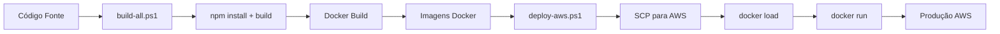

# 🏗️ ConectCRM - Estrutura de Deploy Profissional

## 📖 Sobre Esta Pasta

Esta pasta contém **toda a infraestrutura de deploy profissional** do ConectCRM:
- ✅ Dockerfiles otimizados
- ✅ Scripts de build automatizados
- ✅ Scripts de deploy AWS
- ✅ Orquestração com Docker Compose
- ✅ Configurações de produção

---

## 🚀 Quick Start

### 1️⃣ Build Completo Local

```powershell
cd c:\Projetos\conectcrm\.production

# Build backend + frontend + Docker images
.\scripts\build-all.ps1
```

### 2️⃣ Testar Localmente

```powershell
# Copiar e configurar variáveis de ambiente
cp .env.production .env.production.local
# Editar .env.production.local com valores de teste

# Subir todos os serviços
docker-compose up -d

# Verificar
docker-compose ps
```

**Acessar**:
- Backend: http://localhost:3500
- Frontend: http://localhost:3000
- API Docs: http://localhost:3500/api-docs

### 3️⃣ Deploy na AWS

```powershell
# Deploy automatizado
.\scripts\deploy-aws.ps1 `
  -KeyPath "c:\Projetos\conectcrm\conectcrm-key.pem" `
  -ServerIP "56.124.63.239"
```

---

## 📁 Estrutura de Arquivos

```
.production/
│
├── 📄 README.md                    ← Este arquivo
├── 📄 DEPLOY.md                    ← Guia completo de deploy
├── 📄 docker-compose.yml           ← Orquestração (Postgres, Redis, Backend, Frontend, Nginx)
├── 📄 .env.production              ← Template de variáveis (não commitar valores reais!)
│
├── docker/                         📦 Dockerfiles
│   ├── Dockerfile.backend          ← Build otimizado NestJS (multi-stage)
│   └── Dockerfile.frontend         ← Build otimizado React + Nginx
│
├── configs/                        ⚙️ Configurações
│   └── nginx.conf                  ← Config nginx para React SPA
│
└── scripts/                        🛠️ Scripts Automatizados
    ├── build-all.ps1               ← Build completo (backend + frontend + Docker)
    └── deploy-aws.ps1              ← Deploy automatizado na AWS
```

---

## 📋 Pré-requisitos

| Ferramenta | Versão | Verificar |
|------------|--------|-----------|
| Node.js | 20.x | `node --version` |
| Docker | 24.x | `docker --version` |
| Docker Compose | 2.x | `docker-compose --version` |
| PowerShell | 7.x | `$PSVersionTable.PSVersion` |

---

## 🎯 Por Que Esta Estrutura?

### ❌ Problema Anterior
```powershell
# Deploy manual (frágil e não reproduzível)
scp arquivo.js → AWS
docker cp → container
docker restart
# ⚠️ Mudanças são perdidas ao rebuild do container!
```

### ✅ Solução Profissional
```powershell
# Build + Deploy automatizado (reproduzível)
.\scripts\build-all.ps1      # Build completo
.\scripts\deploy-aws.ps1     # Deploy versionado
# ✅ Mudanças permanentes, rollback facilitado, CI/CD pronto
```

**Vantagens**:
1. ✅ **Reproduzível**: Mesmo resultado em qualquer ambiente
2. ✅ **Versionado**: Imagens Docker taggeadas com timestamp
3. ✅ **Rollback Fácil**: Voltar para imagem anterior em segundos
4. ✅ **CI/CD Ready**: Pronto para GitHub Actions / GitLab CI
5. ✅ **Testável**: Teste localmente antes de deploy
6. ✅ **Documentado**: Guia completo em DEPLOY.md

---

## 📚 Documentação

- **[DEPLOY.md](./DEPLOY.md)** - Guia completo de deploy
  - Pré-requisitos
  - Deploy local
  - Deploy AWS
  - Troubleshooting
  - Rollback
  - Boas práticas

---

## 🔐 Segurança

### ⚠️ IMPORTANTE: Variáveis de Ambiente

1. **NUNCA commite `.env.production.local`!**
2. Template `.env.production` pode ser commitado (sem valores reais)
3. Sempre use variáveis de ambiente para credenciais

```powershell
# ✅ CORRETO
cp .env.production .env.production.local
# Edite .env.production.local com valores reais
# .gitignore já protege este arquivo

# ❌ ERRADO
# Colocar credenciais direto no .env.production
```

---

## 🎓 Como Funciona?

### Fluxo de Deploy



### Dockerfiles Multi-Stage

**Backend** (`Dockerfile.backend`):
```dockerfile
Stage 1: Build
  - npm ci (instalar deps)
  - npm run build (compilar TypeScript)
  - npm prune (remover devDependencies)

Stage 2: Production
  - Copiar apenas node_modules de produção
  - Copiar dist/ compilado
  - Usuário non-root (segurança)
  - Health check configurado
```

**Frontend** (`Dockerfile.frontend`):
```dockerfile
Stage 1: Build
  - npm ci (instalar deps)
  - npm run build (build React)

Stage 2: Nginx
  - Copiar build/ para nginx
  - Config nginx para SPA
  - Health check configurado
```

---

## 🧪 Testes

### Teste Local Rápido

```powershell
# Build + Up
.\scripts\build-all.ps1
docker-compose up -d

# Testes
curl http://localhost:3500/health  # Backend
curl http://localhost:3000         # Frontend

# Logs
docker-compose logs -f backend
docker-compose logs -f frontend

# Down
docker-compose down
```

### Teste AWS (Dry Run)

```powershell
# Simular deploy sem executar
.\scripts\deploy-aws.ps1 -DryRun
```

---

## 🔄 Atualizações Futuras

### Roadmap

- [ ] **CI/CD Automatizado** (GitHub Actions)
  ```yaml
  # .github/workflows/deploy.yml
  on:
    push:
      branches: [main]
  jobs:
    build-and-deploy:
      - Build Docker images
      - Deploy na AWS automaticamente
  ```

- [ ] **Monitoramento** (Prometheus + Grafana)
- [ ] **Backups Automatizados** (PostgreSQL + Redis)
- [ ] **SSL/TLS** (Let's Encrypt)
- [ ] **Load Balancer** (Nginx + múltiplos backends)

---

## 💡 Dicas

### Performance

```powershell
# Limpar cache Docker periodicamente
docker builder prune -a -f

# Verificar tamanho das imagens
docker images | Select-String "conectcrm"

# Otimizar node_modules (se imagem muito grande)
# Use npm ci --production no Dockerfile
```

### Debug

```powershell
# Entrar no container rodando
docker exec -it conectcrm-backend-prod sh

# Verificar variáveis de ambiente
docker exec conectcrm-backend-prod env

# Verificar arquivos
docker exec conectcrm-backend-prod ls -la /app/dist
```

---

## 📞 Suporte

**Problemas?**
1. Leia **[DEPLOY.md](./DEPLOY.md)** seção Troubleshooting
2. Verifique logs: `docker-compose logs -f`
3. Teste localmente antes de deploy AWS

---

## 📝 Versionamento

| Versão | Data | Mudanças |
|--------|------|----------|
| 1.0.0 | 2025-11-02 | Estrutura inicial de deploy profissional |

---

**Criado por**: Equipe ConectCRM  
**Última atualização**: 2 de novembro de 2025
