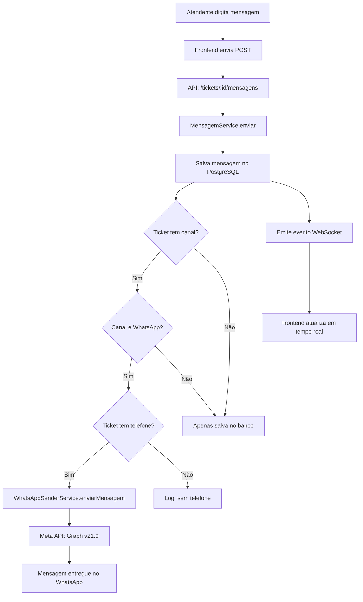

# 🚀 CHAT COM ENVIO REAL IMPLEMENTADO

## 📅 Data: 13/10/2025
## ✅ Status: Pronto para Testes

---

## 🎯 **O QUE FOI IMPLEMENTADO**

### ✅ **1. Integração WhatsApp Business API**
O chat agora envia mensagens REAIS via WhatsApp quando o ticket pertence a um canal WhatsApp.

**Arquivo modificado:** `backend/src/modules/atendimento/services/mensagem.service.ts`

**Mudanças:**
- ✅ Injetado `WhatsAppSenderService` (serviço já existente)
- ✅ Injetado repositórios de `Ticket` e `Canal`
- ✅ Injetado `AtendimentoGateway` para WebSocket
- ✅ Lógica de envio automático quando canal for WhatsApp
- ✅ Emissão de eventos WebSocket para tempo real

---

## 🔄 **FLUXO COMPLETO DE ENVIO**



---

## 📝 **CÓDIGO IMPLEMENTADO**

### **mensagem.service.ts** (Linhas 329-434)

```typescript
// 🔥 ENVIAR VIA WHATSAPP SE FOR CANAL WHATSAPP
try {
  const ticket = await this.ticketRepository.findOne({
    where: { id: dados.ticketId }
  });

  if (!ticket) {
    this.logger.warn(`⚠️ Ticket não encontrado`);
  } else if (ticket.canalId) {
    const canal = await this.canalRepository.findOne({
      where: { id: ticket.canalId }
    });

    if (canal && canal.tipo === TipoCanal.WHATSAPP) {
      this.logger.log(`📱 Canal WhatsApp detectado, enviando...`);
      
      if (ticket.contatoTelefone) {
        const resultado = await this.whatsappSenderService.enviarMensagem(
          ticket.empresaId,
          ticket.contatoTelefone,
          dados.conteudo
        );

        if (resultado.sucesso) {
          this.logger.log(`✅ Enviada via WhatsApp: ${resultado.messageId}`);
        } else {
          this.logger.error(`❌ Erro: ${resultado.erro}`);
        }
      }
    }
  }
} catch (error) {
  this.logger.error(`❌ Erro ao enviar via gateway: ${error.message}`);
  // Não falha o fluxo, mensagem já está no banco
}

// 🔥 EMITIR EVENTO WEBSOCKET
this.atendimentoGateway.notificarNovaMensagem(mensagemSalva);
```

---

## 🧪 **COMO TESTAR O FLUXO COMPLETO**

### **PASSO 1: Verificar Configurações**

#### 1.1. Token WhatsApp cadastrado?
```sql
SELECT 
  id,
  empresa_id,
  tipo,
  ativo,
  credenciais->>'whatsapp_api_token' as token,
  credenciais->>'whatsapp_phone_number_id' as phone_id
FROM atendimento_integracoes_config
WHERE tipo = 'whatsapp_business_api'
AND ativo = true;
```

**✅ Deve retornar:** 1 registro com token e phone_id preenchidos

#### 1.2. Canal WhatsApp existe?
```sql
SELECT id, empresa_id, nome, tipo, status
FROM atendimento_canais
WHERE tipo = 'whatsapp'
AND status = 'ativo';
```

**✅ Deve retornar:** Pelo menos 1 canal ativo

---

### **PASSO 2: Iniciar Backend**

```powershell
cd C:\Projetos\conectcrm\backend
npm run start:dev
```

**Logs esperados:**
```
[Nest] LOG [InstanceLoader] AppModule dependencies initialized
[Nest] LOG [RoutesResolver] TicketController {/api/atendimento/tickets}
[Nest] LOG [RoutesResolver] Mapped {POST, /api/atendimento/tickets/:id/mensagens}
[Nest] LOG [NestApplication] Nest application successfully started
```

---

### **PASSO 3: Iniciar Frontend**

```powershell
cd C:\Projetos\conectcrm\frontend-web
npm start
```

Acessar: **http://localhost:3000/atendimento**

---

### **PASSO 4: Criar Ticket de Teste (Via WhatsApp Real)**

#### Opção A: Webhook WhatsApp (RECOMENDADO)
1. Enviar mensagem do seu celular para o número WhatsApp Business configurado
2. Webhook vai receber e criar ticket automaticamente
3. Ticket terá canal WhatsApp + telefone do cliente

#### Opção B: Criar manualmente no banco
```sql
-- Buscar ID do canal WhatsApp
SELECT id FROM atendimento_canais WHERE tipo = 'whatsapp' LIMIT 1;

-- Criar ticket (substitua os IDs)
INSERT INTO atendimento_tickets (
  id,
  numero,
  assunto,
  status,
  prioridade,
  canal_id,
  empresa_id,
  contato_telefone,
  contato_nome,
  data_abertura,
  created_at,
  updated_at
) VALUES (
  gen_random_uuid(),
  1001,
  'Teste de Envio WhatsApp',
  'ABERTO',
  'MEDIA',
  '<SEU_CANAL_ID_AQUI>',  -- ⚠️ Substituir
  '<SUA_EMPRESA_ID_AQUI>', -- ⚠️ Substituir
  '5511999887766',         -- ⚠️ Seu telefone real (formato: 55 + DDD + número com 9)
  'Cliente Teste',
  NOW(),
  NOW(),
  NOW()
) RETURNING id;
```

---

### **PASSO 5: Enviar Mensagem pelo Chat**

1. Na interface de atendimento, abrir o ticket criado
2. Digitar mensagem: **"Olá! Esta é uma mensagem de teste do sistema ConectCRM"**
3. Clicar em **Enviar** ou pressionar **Enter**

---

### **PASSO 6: Verificar Logs do Backend**

**Logs esperados (sucesso):**
```
📤 Enviando mensagem para ticket abc-123-def
✅ Mensagem salva no banco de dados
📱 Canal WhatsApp detectado, enviando mensagem...
   Empresa: empresa-id-123
   Telefone: 5511999887766
📤 Enviando mensagem WhatsApp
🔍 DEBUG: Configuração encontrada: config-id
📱 Normalizando número de telefone...
   Original: 5511999887766
   Limpo: 5511999887766
   Corrigido: 5511999887766
   Validação: ✅ VÁLIDO
📤 Enviando para: 5511999887766
✅ Mensagem enviada via WhatsApp: wamid.xxx
📡 Evento WebSocket emitido: nova_mensagem
```

**Logs em caso de erro:**
```
❌ Erro ao enviar via WhatsApp: Invalid token
❌ Erro ao enviar via WhatsApp: Phone number not found
❌ Erro ao enviar via WhatsApp: (#131030) Recipient phone number not in allowed list
```

---

### **PASSO 7: Verificar WhatsApp Real**

1. Abrir WhatsApp no celular cadastrado em `contato_telefone`
2. Verificar se recebeu a mensagem do número Business
3. ✅ **SUCESSO!** Mensagem deve aparecer na conversa

---

## 🔍 **DIAGNÓSTICO DE PROBLEMAS**

### ❌ **Problema: Mensagem não chega no WhatsApp**

#### Verificar 1: Token válido?
```bash
curl -X GET "https://graph.facebook.com/v21.0/me?access_token=SEU_TOKEN_AQUI"
```
**Esperado:** `{ "id": "..." }`

#### Verificar 2: Número está na whitelist?
Durante sandbox, apenas números autorizados podem receber mensagens.
- Acessar: https://developers.facebook.com/apps/
- App → WhatsApp → Configurações → Números de teste
- Adicionar seu número com código de confirmação

#### Verificar 3: Formato do telefone
```
✅ Correto: 5511999887766 (código país + DDD + 9 dígitos)
❌ Errado: 11999887766 (falta código 55)
❌ Errado: 551199887766 (DDD com zero)
```

---

### ❌ **Problema: Erro "Canal não encontrado"**

```sql
-- Verificar se ticket tem canalId
SELECT id, canal_id FROM atendimento_tickets WHERE id = 'SEU_TICKET_ID';

-- Se canal_id for NULL, atualizar:
UPDATE atendimento_tickets
SET canal_id = (SELECT id FROM atendimento_canais WHERE tipo = 'whatsapp' LIMIT 1)
WHERE id = 'SEU_TICKET_ID';
```

---

### ❌ **Problema: Erro "Credenciais incompletas"**

```sql
-- Verificar credenciais
SELECT 
  credenciais->>'whatsapp_api_token' as token,
  credenciais->>'whatsapp_phone_number_id' as phone_id
FROM atendimento_integracoes_config
WHERE tipo = 'whatsapp_business_api';

-- Se estiverem vazios, atualizar (use o script atualizar-token-whatsapp.ps1)
```

---

## 📊 **VALIDAÇÃO FINAL**

### ✅ Checklist de Sucesso

- [ ] Backend compilou sem erros
- [ ] Frontend carrega a tela de atendimento
- [ ] Token WhatsApp configurado no banco
- [ ] Canal WhatsApp ativo existe
- [ ] Ticket tem `canal_id` preenchido
- [ ] Ticket tem `contato_telefone` válido
- [ ] Mensagem salvou no banco (tabela `atendimento_mensagens`)
- [ ] Log mostra "✅ Mensagem enviada via WhatsApp"
- [ ] Mensagem chegou no WhatsApp real

### 📈 Métricas de Sucesso

```sql
-- Mensagens enviadas nas últimas 24h
SELECT 
  DATE_TRUNC('hour', created_at) as hora,
  COUNT(*) as total_mensagens
FROM atendimento_mensagens
WHERE remetente = 'ATENDENTE'
AND created_at >= NOW() - INTERVAL '24 hours'
GROUP BY hora
ORDER BY hora DESC;

-- Taxa de sucesso (verificar nos logs)
-- Sucesso: Log contém "✅ Mensagem enviada via WhatsApp: wamid"
-- Falha: Log contém "❌ Erro ao enviar via WhatsApp"
```

---

## 🎉 **RESULTADO ESPERADO**

Após seguir todos os passos:

1. ✅ Atendente digita mensagem no chat
2. ✅ Mensagem salva no PostgreSQL
3. ✅ Sistema detecta canal WhatsApp
4. ✅ Envia via Meta Graph API
5. ✅ Cliente recebe no WhatsApp real
6. ✅ Evento WebSocket notifica outros atendentes
7. ✅ Interface atualiza em tempo real

**🎯 FLUXO COMPLETO FUNCIONAL PARA TESTES REAIS!**

---

## 🔜 **PRÓXIMOS PASSOS**

- [ ] Testar envio de imagens/áudios
- [ ] Testar múltiplos atendentes simultâneos
- [ ] Implementar indicador "mensagem entregue"
- [ ] Adicionar retry automático em caso de falha
- [ ] Implementar fila de envio com Bull
- [ ] Logs detalhados de auditoria
- [ ] Métricas de performance (tempo de resposta)

---

## 📚 **DOCUMENTOS RELACIONADOS**

- `CONFIGURACAO_META_WHATSAPP.md` - Como configurar token
- `GERAR_TOKEN_WHATSAPP.md` - Guia para gerar token
- `ADICIONAR_NUMERO_WHITELIST.md` - Adicionar números de teste
- `atualizar-token-whatsapp.ps1` - Script para atualizar token

---

**✨ Sistema pronto para testes de atendimento real!**
