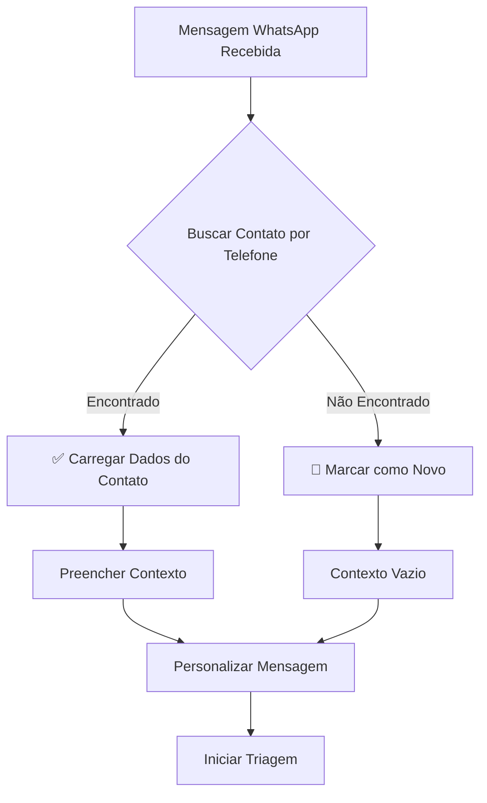

# 🔍 Consulta Automática de Contatos na Triagem

## 📋 Visão Geral

O sistema de triagem agora **consulta automaticamente** se o contato já está cadastrado no banco de dados antes de iniciar o atendimento, proporcionando uma experiência personalizada e evitando coleta duplicada de informações.

---

## ✨ Funcionalidades Implementadas

### **1. Busca Automática por Telefone**
- Quando uma mensagem chega via WhatsApp, o sistema busca automaticamente o contato no banco
- Consulta feita pela tabela `contatos` usando o telefone normalizado
- Carrega também os dados da empresa/cliente associado (relação `cliente`)

### **2. Personalização da Mensagem de Boas-Vindas**
- **Cliente Cadastrado:** "👋 Olá, [Nome]! Que bom ter você de volta! 😊"
- **Cliente Novo:** "👋 Olá! Eu sou a assistente virtual da ConectCRM."

### **3. Pré-preenchimento do Contexto**
Quando o contato é encontrado, os seguintes dados são automaticamente carregados no contexto da sessão:

```typescript
contexto.nome = "João Silva"
contexto.telefone = "5511999999999"
contexto.email = "joao@empresa.com"
contexto.cargo = "Gerente"
contexto.empresa = "Empresa XYZ Ltda"
contexto.__contatoId = "uuid-do-contato"
contexto.__clienteId = "uuid-do-cliente"
contexto.__clienteCadastrado = true
```

### **4. Otimização do Fluxo de Coleta**
Com os dados já disponíveis, é possível:
- **Pular etapas de coleta de nome/telefone/email** (implementação futura)
- **Confirmar dados** em vez de pedir novamente
- **Ir direto ao assunto** do atendimento

---

## 🎯 Como Funciona

### **Fluxo Técnico**



### **Exemplo Prático**

#### **Contato Cadastrado:**
```
👋 Olá, Maria Santos! Que bom ter você de volta! 😊

Eu sou a assistente virtual da ConectCRM.
Escolha uma das opções abaixo para continuar:

1️⃣ Suporte técnico
2️⃣ Financeiro
3️⃣ Comercial
...
```

#### **Contato Novo:**
```
👋 Olá! Eu sou a assistente virtual da ConectCRM.
Escolha uma das opções abaixo para continuar:

1️⃣ Suporte técnico
2️⃣ Financeiro
3️⃣ Comercial
...
```

---

## 🔧 Código Implementado

### **1. Método de Busca**
```typescript
private async buscarContatoPorTelefone(
  empresaId: string,
  telefone: string,
): Promise<Contato | null> {
  const telefoneNormalizado = this.normalizarTelefone(telefone);
  
  const contato = await this.contatoRepository.findOne({
    where: {
      telefone: telefoneNormalizado,
      ativo: true,
    },
    relations: ['cliente'],
  });

  return contato;
}
```

### **2. Integração no Início da Triagem**
```typescript
async iniciarTriagem(...) {
  // 🔍 Buscar contato existente
  const contatoExistente = await this.buscarContatoPorTelefone(
    empresaId, 
    dto.contatoTelefone
  );

  // ✨ Preencher contexto se encontrado
  if (contatoExistente) {
    contextoInicial.nome = contatoExistente.nome;
    contextoInicial.__clienteCadastrado = true;
    // ... outros campos
  }
}
```

### **3. Personalização da Mensagem**
```typescript
private montarRespostaEtapa(...) {
  let mensagem = etapa.mensagem;

  // ✨ Personalizar boas-vindas para clientes cadastrados
  if (sessao.etapaAtual === 'boas-vindas' && 
      sessao.contexto?.__clienteCadastrado === true) {
    const saudacao = `👋 Olá, ${sessao.contexto.nome}! Que bom ter você de volta! 😊`;
    mensagem = mensagem.replace(
      '👋 Olá! Eu sou a assistente virtual da ConectCRM.',
      saudacao
    );
  }
}
```

---

## 📊 Benefícios

### **Para o Cliente:**
- ✅ **Reconhecimento imediato** - Sente-se valorizado
- ✅ **Menos repetição** - Não precisa fornecer dados já cadastrados
- ✅ **Atendimento mais rápido** - Menos etapas para completar
- ✅ **Experiência personalizada** - Mensagens com o nome dele

### **Para a Empresa:**
- ✅ **Histórico completo** - Vincula automaticamente ao cadastro existente
- ✅ **Dados atualizados** - Usa informações mais recentes do banco
- ✅ **Rastreabilidade** - Liga atendimento ao cliente/contato correto
- ✅ **Relatórios precisos** - Métricas por cliente real

---

## 🚀 Evolução Futura

### **Fase 2: Lógica Condicional no Fluxo**
Modificar o fluxo de triagem para:
- **Pular etapa "coleta-nome"** se `contexto.__clienteCadastrado === true`
- **Pular etapa "coleta-contato"** se email já existe
- **Ir direto para "coleta-resumo"** ou escolha de núcleo

### **Exemplo de Fluxo Condicional:**
```json
{
  "etapas": {
    "boas-vindas": {
      "tipo": "mensagem_menu",
      "proximaEtapa": null,
      "etapaCondicional": {
        "condicoes": [
          {
            "se": "contexto.__clienteCadastrado === true",
            "entao": "coleta-resumo"
          },
          {
            "se": "contexto.__clienteCadastrado === false",
            "entao": "coleta-nome"
          }
        ]
      }
    }
  }
}
```

### **Fase 3: Confirmação de Dados**
Em vez de pular, perguntar:
```
Encontrei seu cadastro:
Nome: Maria Santos
Email: maria@startup.com
Empresa: StartUp XYZ

Esses dados estão corretos? (SIM/NÃO)
```

---

## 🧪 Como Testar

### **1. Testar com Contato Cadastrado**
```sql
-- Verificar se existe contato com o telefone
SELECT * FROM contatos 
WHERE telefone = '5562996689991' 
AND ativo = true;

-- Se não existir, criar um para teste
INSERT INTO contatos (
  id, nome, telefone, email, cargo, ativo, cliente_id, 
  created_at, updated_at
) VALUES (
  gen_random_uuid(),
  'Teste WhatsApp',
  '5562996689991',
  'teste@whatsapp.com',
  'Gerente de Testes',
  true,
  (SELECT id FROM clientes LIMIT 1),
  NOW(),
  NOW()
);
```

### **2. Enviar Mensagem pelo WhatsApp**
- Envie "Oi" para o número configurado
- Observe no log:
  ```
  ✅ Contato encontrado: Teste WhatsApp (5562996689991)
  🎯 Cliente reconhecido: Teste WhatsApp
  ```
- Verifique a mensagem personalizada: "Olá, Teste WhatsApp!"

### **3. Testar com Número Novo**
- Use um número diferente que não esteja no banco
- Observe no log:
  ```
  ❌ Nenhum contato encontrado para: 5511888888888
  👤 Novo contato - será necessário coletar dados
  ```
- Verifique a mensagem padrão: "Olá! Eu sou a assistente..."

---

## 📁 Arquivos Modificados

- ✅ `backend/src/modules/triagem/services/triagem-bot.service.ts`
  - Adicionado método `buscarContatoPorTelefone()`
  - Modificado `iniciarTriagem()` para buscar e preencher contexto
  - Atualizado `montarRespostaEtapa()` para personalizar mensagem
  
- ✅ `backend/src/modules/triagem/triagem.module.ts`
  - Registrado repositório `Contato` no módulo

---

## ⚙️ Configuração

### **Pré-requisitos**
- ✅ Tabela `contatos` existente no banco
- ✅ Relação `cliente` configurada na entidade `Contato`
- ✅ Campo `telefone` normalizado e indexado

### **Campos Utilizados**
```typescript
interface Contato {
  id: string;              // UUID do contato
  nome: string;            // Nome completo
  telefone: string;        // Telefone normalizado (5511999999999)
  email: string;           // Email (opcional)
  cargo: string;           // Cargo/função (opcional)
  ativo: boolean;          // Se o contato está ativo
  cliente: Cliente;        // Relação com empresa/cliente
}
```

---

## 🎓 Conclusão

A funcionalidade de **consulta automática de contatos** eleva a experiência do usuário e a eficiência operacional do sistema de triagem. Com reconhecimento inteligente e personalização contextual, o atendimento se torna mais humano, ágil e profissional.

**Status:** ✅ **Implementado e Pronto para Uso**

---

**Desenvolvido por:** Copilot + Equipe ConectCRM  
**Data:** 17/10/2025  
**Versão:** 1.0
