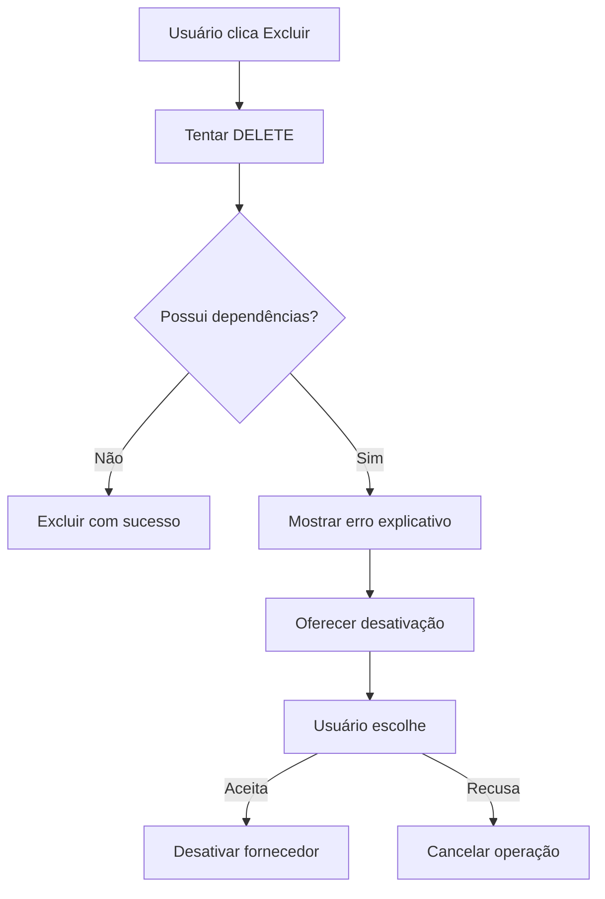

# Correção - Erro de Integridade Referencial ao Excluir Fornecedor

## 🚨 Problema Identificado

Erro ao tentar excluir fornecedor que possui contas a pagar vinculadas:

```
error: update or delete on table "fornecedores" violates foreign key constraint "fk_contas_pagar_fornecedor" on table "contas_pagar"
```

## ✅ Solução Implementada

### 1. **Tratamento de Integridade Referencial**

**Arquivo**: `backend/src/modules/financeiro/services/fornecedor.service.ts`

#### Adicionada validação prévia:
```typescript
async remove(id: string, empresaId: string): Promise<void> {
  try {
    await this.verificarDependencias(id);
    await this.fornecedorRepository.remove(fornecedor);
  } catch (error) {
    if (error.code === '23503' || error.message.includes('foreign key constraint')) {
      throw new BadRequestException(
        'Não é possível excluir este fornecedor pois ele possui contas a pagar vinculadas.'
      );
    }
    throw error;
  }
}
```

#### Método de verificação de dependências:
```typescript
private async verificarDependencias(fornecedorId: string): Promise<void> {
  const contasPagar = await this.fornecedorRepository.query(
    'SELECT COUNT(*) as total FROM contas_pagar WHERE fornecedor_id = $1',
    [fornecedorId]
  );
  
  if (parseInt(contasPagar[0]?.total || '0') > 0) {
    throw new BadRequestException('Fornecedor possui contas a pagar vinculadas');
  }
}
```

### 2. **Alternativa Segura - Desativação**

#### Novo método para desativar em vez de excluir:
```typescript
async desativar(id: string, empresaId: string): Promise<Fornecedor> {
  const fornecedor = await this.findOne(id, empresaId);
  fornecedor.ativo = false;
  return await this.fornecedorRepository.save(fornecedor);
}
```

### 3. **Novo Endpoint no Controller**

**Arquivo**: `backend/src/modules/financeiro/controllers/fornecedor.controller.ts`

```typescript
@Patch(':id/desativar')
@UseGuards(JwtAuthGuard)
async desativar(@Param('id') id: string, @Request() req) {
  const empresaId = req.user.empresa_id;
  const fornecedor = await this.fornecedorService.desativar(id, empresaId);
  return { 
    message: 'Fornecedor desativado com sucesso',
    fornecedor
  };
}
```

## 🔧 APIs Disponíveis

### 1. **Excluir Fornecedor** (com validação)
```http
DELETE /fornecedores/{id}
```
- ✅ Valida se não possui contas a pagar
- ❌ Retorna erro claro se houver dependências
- 🗑️ Exclui permanentemente se possível

### 2. **Desativar Fornecedor** (alternativa segura)
```http
PATCH /fornecedores/{id}/desativar
```
- ✅ Sempre funciona
- 🔒 Mantém dados para auditoria
- 👁️ Oculta da lista de fornecedores ativos

## 💡 Recomendações de UX

### Frontend - Implementar lógica inteligente:

```typescript
// Tentar excluir primeiro
try {
  await api.delete(`/fornecedores/${id}`);
  showSuccess('Fornecedor excluído com sucesso');
} catch (error) {
  if (error.status === 400 && error.message.includes('contas a pagar')) {
    // Oferecer alternativa de desativação
    const confirm = await showConfirm(
      'Este fornecedor possui contas a pagar vinculadas.',
      'Deseja desativá-lo em vez de excluir?'
    );
    
    if (confirm) {
      await api.patch(`/fornecedores/${id}/desativar`);
      showSuccess('Fornecedor desativado com sucesso');
    }
  }
}
```

## 🛡️ Benefícios da Solução

1. **Segurança de Dados**: Evita perda de dados por exclusão acidental
2. **Mensagens Claras**: Usuário entende exatamente o problema
3. **Alternativa Prática**: Desativação mantém histórico e resolve o problema
4. **Auditoria**: Dados preservados para relatórios e compliance
5. **UX Melhorada**: Fluxo intuitivo com opções claras

## 📊 Fluxo Recomendado



## ✅ Status

- ✅ **Backend corrigido** - Tratamento de integridade referencial
- ✅ **Endpoints implementados** - DELETE com validação + PATCH desativar
- ✅ **Mensagens claras** - Erros explicativos para o usuário
- ⏳ **Frontend pendente** - Implementar lógica de fallback

---

**Data**: 03/08/2025 19:15
**Arquivo**: CORRECAO_INTEGRIDADE_FORNECEDOR.md
