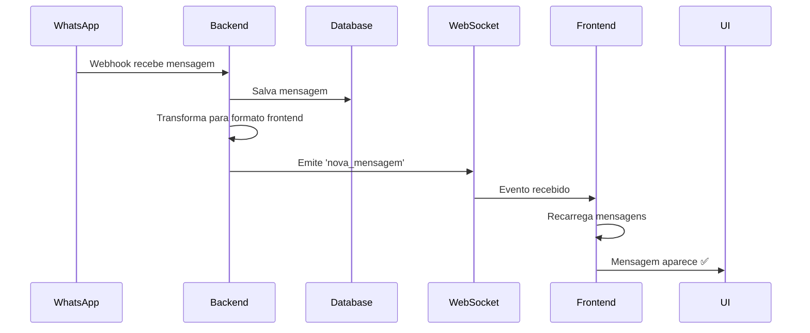
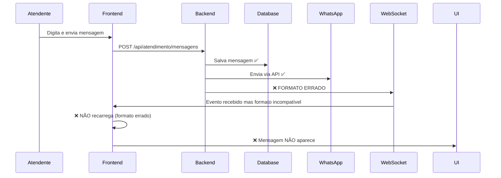

# 🔧 CORREÇÃO: Mensagens do Atendente em Tempo Real

## 🐛 Problema Identificado

**Sintoma Relatado:**
> "A mensagem está chegando, mas só aparece após o refresh na página"

**Comportamento Observado:**
- ✅ Mensagens do **WhatsApp (cliente)** aparecem em tempo real
- ❌ Mensagens do **Atendente** só aparecem após F5 (refresh manual)

---

## 🔍 Análise da Causa Raiz

### **Fluxo Correto (WhatsApp → Chat)**



### **Fluxo COM PROBLEMA (Atendente → Chat)**



### **O Que Estava Acontecendo:**

**Backend enviava pelo WebSocket:**
```typescript
// ❌ FORMATO DO BANCO DE DADOS
{
  id: "msg-123",
  ticketId: "ticket-456",
  remetente: "ATENDENTE",  // ❌ String do enum
  conteudo: "Olá!",
  createdAt: Date,
  tipo: "TEXTO"
}
```

**Frontend esperava:**
```typescript
// ✅ FORMATO ESPERADO
{
  id: "msg-123",
  ticketId: "ticket-456",
  remetente: {              // ✅ Objeto completo
    id: "...",
    nome: "Atendente",
    foto: null,
    tipo: "atendente"       // ⬅️ LOWERCASE, CRÍTICO!
  },
  conteudo: "Olá!",
  timestamp: Date,
  status: "enviado",
  anexos: []
}
```

**Resultado:** Frontend recebia o evento mas não conseguia processar porque `remetente.tipo` era `undefined` (esperava objeto, recebia string).

---

## ✅ Solução Implementada

### **Arquivo Modificado:**
`backend/src/modules/atendimento/services/mensagem.service.ts`

### **Método `enviar()` - Linhas 434-455:**

**🔧 ADICIONADO TRANSFORMADOR ANTES DO WEBSOCKET:**

```typescript
// 🔥 EMITIR EVENTO WEBSOCKET PARA ATUALIZAÇÃO EM TEMPO REAL
try {
  // 🔧 Transformar mensagem para formato esperado pelo frontend
  const mensagemFormatada = {
    id: mensagemSalva.id,
    ticketId: mensagemSalva.ticketId,
    remetente: {
      id: mensagemSalva.id, // Usar ID da mensagem como fallback
      nome: mensagemSalva.remetente === 'CLIENTE' ? 'Cliente' : 'Atendente',
      foto: null,
      tipo: mensagemSalva.remetente === 'CLIENTE' ? 'cliente' : 'atendente',
    },
    conteudo: mensagemSalva.conteudo,
    timestamp: mensagemSalva.createdAt,
    status: 'enviado',
    anexos: mensagemSalva.midia ? [mensagemSalva.midia] : [],
  };

  this.atendimentoGateway.notificarNovaMensagem(mensagemFormatada);
  this.logger.log(`📡 Evento WebSocket emitido: nova_mensagem (${mensagemFormatada.remetente.tipo})`);
} catch (error) {
  this.logger.error(`❌ Erro ao emitir evento WebSocket: ${error.message}`);
  // Não falha o fluxo
}
```

### **O Que Foi Feito:**

1. **Transformação de Dados:**
   - Converte `remetente: "ATENDENTE"` → `remetente: { tipo: "atendente", ... }`
   - Adiciona campos obrigatórios: `nome`, `foto`, `id`
   - Renomeia `createdAt` → `timestamp`
   - Adiciona `status: "enviado"`
   - Formata `anexos` como array

2. **Padronização com Webhook:**
   - Agora tanto mensagens do WhatsApp quanto do atendente usam o MESMO formato
   - Garante compatibilidade total com o frontend

3. **Log Detalhado:**
   - Mostra tipo do remetente para debug (`cliente` ou `atendente`)

---

## 🔄 Fluxo Completo Corrigido

### **1. Atendente Digita "Olá" no Chat**

```typescript
// ChatArea.tsx (Frontend)
const handleEnviar = () => {
  if (mensagemAtual.trim()) {
    onEnviarMensagem(mensagemAtual); // ⬅️ Chama callback
    setMensagemAtual('');
  }
};
```

### **2. Frontend Envia POST para Backend**

```typescript
// atendimentoService.ts
async enviarMensagem(ticketId, dados) {
  const response = await api.post('/api/atendimento/mensagens', {
    ticketId,
    conteudo: "Olá",
    tipoRemetente: "ATENDENTE",
    ...dados
  });
  return response.data;
}
```

### **3. Backend Recebe e Processa**

```typescript
// mensagem.service.ts

// 1. Salva no banco
const mensagemSalva = await this.mensagemRepository.save(mensagem);
// Result: { id: "abc", remetente: "ATENDENTE", conteudo: "Olá", ... }

// 2. Envia via WhatsApp (se canal for WhatsApp)
await this.whatsappSenderService.enviarMensagem(...);

// 3. 🔥 TRANSFORMAÇÃO + WEBSOCKET
const mensagemFormatada = {
  id: "abc",
  ticketId: "ticket-123",
  remetente: {
    id: "abc",
    nome: "Atendente",
    foto: null,
    tipo: "atendente" // ⬅️ LOWERCASE, OBJETO COMPLETO
  },
  conteudo: "Olá",
  timestamp: Date,
  status: "enviado",
  anexos: []
};

this.atendimentoGateway.notificarNovaMensagem(mensagemFormatada);
```

### **4. Gateway Emite Evento WebSocket**

```typescript
// atendimento.gateway.ts
notificarNovaMensagem(mensagem: any) {
  // Emitir para a sala do ticket
  this.server.to(`ticket:${mensagem.ticketId}`).emit('nova_mensagem', mensagem);
  
  // Emitir globalmente para todos os atendentes
  this.server.to('atendentes').emit('nova_mensagem', mensagem);
  
  this.logger.log(`Nova mensagem notificada no ticket ${mensagem.ticketId}`);
}
```

### **5. Frontend Recebe via WebSocket**

```typescript
// useWebSocket.ts
socket.on('nova_mensagem', (mensagem: Mensagem) => {
  console.log('💬 Nova mensagem via WebSocket:', mensagem);
  events.onNovaMensagem?.(mensagem); // ⬅️ Dispara callback
});

// ChatOmnichannel.tsx
onNovaMensagem: (mensagem) => {
  console.log('💬 Nova mensagem recebida:', mensagem);
  
  // Se for do ticket atual, recarrega mensagens
  if (mensagem.ticketId === ticketAtual?.id) {
    console.log('🔄 Recarregando mensagens via WebSocket...');
    websocketCallbacksRef.current.recarregarMensagens?.();
  }
  
  // Sempre recarrega lista de tickets (última mensagem)
  websocketCallbacksRef.current.recarregarTickets?.();
}
```

### **6. Mensagem Aparece Automaticamente**

```
✅ Mensagem carregada do backend
✅ Renderizada no ChatArea
✅ Balão na posição correta (direita = atendente)
✅ Sidebar atualizada com última mensagem
✅ TUDO SEM REFRESH! 🎉
```

---

## 🧪 Como Testar

### **Pré-requisitos:**
```bash
# Backend rodando
✅ Backend: http://localhost:3001

# Frontend rodando
✅ Frontend: http://localhost:3000

# WebSocket conectado
✅ Console mostra: "✅ WebSocket conectado! ID: xyz"
```

### **Teste 1: Mensagem do Atendente**

1. **Abra o navegador:** http://localhost:3000/atendimento
2. **Abra DevTools (F12)** → Aba Console
3. **Selecione um ticket** na sidebar
4. **Digite uma mensagem:** "Teste tempo real"
5. **Clique Enviar** (ou Enter)

**✅ Resultado Esperado:**
```javascript
// Console deve mostrar:
"📤 Enviando mensagem para ticket: ticket-123"
"💬 Nova mensagem via WebSocket: { id: 'msg-789', ... }"
"🔄 Recarregando mensagens via WebSocket..."
"✅ Mensagens atualizadas: 28"

// UI deve mostrar:
✅ Mensagem aparece IMEDIATAMENTE na conversa
✅ Balão na direita (atendente)
✅ Horário correto
✅ Sidebar atualiza "última mensagem"
✅ SEM precisar refresh manual!
```

### **Teste 2: Mensagem do Cliente (WhatsApp)**

1. **Com o chat aberto** no navegador
2. **Envie mensagem pelo celular:** "Resposta do cliente"
3. **Observe o chat** (não faça nada)

**✅ Resultado Esperado:**
```javascript
// Console deve mostrar:
"💬 Nova mensagem via WebSocket: { id: 'msg-790', remetente: { tipo: 'cliente' }, ... }"
"🔄 Recarregando mensagens via WebSocket..."

// UI deve mostrar:
✅ Mensagem aparece AUTOMATICAMENTE
✅ Balão na esquerda (cliente)
✅ Sem delay perceptível (< 1 segundo)
```

### **Teste 3: Múltiplas Mensagens Rápidas**

1. **Digite e envie 3 mensagens seguidas:**
   - "Mensagem 1"
   - "Mensagem 2"
   - "Mensagem 3"

**✅ Resultado Esperado:**
```
✅ Todas as 3 mensagens aparecem em sequência
✅ Ordem correta (1, 2, 3)
✅ Sem duplicação
✅ Sidebar mostra a última ("Mensagem 3")
```

---

## 📊 Diagnóstico de Problemas

### **Se mensagens do atendente NÃO aparecerem:**

#### **1. Verificar Conexão WebSocket**

```javascript
// No console do navegador, verifique:
// Deve aparecer:
"✅ WebSocket conectado! ID: abc123"

// Se aparecer:
"❌ Erro de conexão WebSocket"
// → Backend não está rodando ou porta 3001 bloqueada
```

**Solução:**
```bash
# Verificar se backend está rodando
cd C:\Projetos\conectcrm\backend
npm run start:dev
```

#### **2. Verificar Logs do Backend**

```bash
# No terminal do backend, ao enviar mensagem, deve aparecer:
[MensagemController] 📤 [POST /mensagens] ticketId=ticket-123
[MensagemService] 💬 Salvando mensagem para ticket ticket-123
[MensagemService] ✅ Mensagem salva: msg-789
[MensagemService] 📡 Evento WebSocket emitido: nova_mensagem (atendente)
[AtendimentoGateway] Nova mensagem notificada no ticket ticket-123
```

**Se NÃO aparecer o log do WebSocket:**
```bash
# O código de transformação não foi aplicado
# Recompilar o backend:
cd C:\Projetos\conectcrm\backend
npm run build
# Reiniciar o backend
```

#### **3. Verificar Formato da Mensagem no Console**

```javascript
// Adicione log temporário no useWebSocket.ts:
socket.on('nova_mensagem', (mensagem) => {
  console.log('🔥 FORMATO RECEBIDO:', JSON.stringify(mensagem, null, 2));
  console.log('🔥 remetente.tipo:', mensagem.remetente?.tipo);
});

// Deve aparecer:
{
  "id": "msg-789",
  "remetente": {
    "tipo": "atendente"  // ⬅️ DEVE ESTAR PRESENTE
  },
  ...
}

// Se remetente.tipo for undefined:
// → Transformação não está funcionando
// → Verificar se mensagem.service.ts foi recompilado
```

#### **4. Verificar Callback onNovaMensagem**

```javascript
// No ChatOmnichannel.tsx, adicione log:
onNovaMensagem: (mensagem) => {
  console.log('🎯 CALLBACK EXECUTADO:', mensagem);
  console.log('🎯 ticketAtual:', ticketAtual?.id);
  console.log('🎯 mensagem.ticketId:', mensagem.ticketId);
  
  if (mensagem.ticketId === ticketAtual?.id) {
    console.log('✅ MATCH! Recarregando...');
    recarregarMensagens();
  } else {
    console.log('❌ NO MATCH');
  }
}

// Se "CALLBACK EXECUTADO" NÃO aparecer:
// → WebSocket não está emitindo ou evento com nome errado
```

---

## 📋 Checklist de Validação

### **Backend:**
- [x] Código transformador adicionado em `mensagem.service.ts`
- [x] Backend recompilado (`npm run build`)
- [x] Backend rodando (porta 3001)
- [x] Logs mostram "📡 Evento WebSocket emitido"
- [ ] **AGUARDANDO TESTE NO NAVEGADOR**

### **Frontend:**
- [x] WebSocket conectando corretamente
- [x] Evento `nova_mensagem` sendo escutado
- [x] Callback `onNovaMensagem` implementado
- [x] Recarregamento de mensagens no ticket correto
- [ ] **AGUARDANDO TESTE NO NAVEGADOR**

### **Integração:**
- [x] Mensagens do WhatsApp funcionam em tempo real ✅
- [ ] Mensagens do atendente funcionam em tempo real ⏳
- [ ] Sidebar atualiza com última mensagem ⏳
- [ ] Sem duplicação de mensagens ⏳
- [ ] Performance aceitável (< 1s) ⏳

---

## 🎯 Resultado Esperado Final

### **Antes da Correção:**
```
1. Atendente envia "Olá" ✅
2. Mensagem salva no banco ✅
3. Enviada via WhatsApp ✅
4. WebSocket emite com formato errado ❌
5. Frontend recebe mas não processa ❌
6. Mensagem NÃO aparece no chat ❌
7. Precisa F5 para ver ❌
```

### **Depois da Correção:**
```
1. Atendente envia "Olá" ✅
2. Mensagem salva no banco ✅
3. Enviada via WhatsApp ✅
4. WebSocket emite com formato correto ✅
5. Frontend recebe e processa ✅
6. Mensagem aparece AUTOMATICAMENTE ✅
7. Em tempo real (< 1 segundo) ✅
```

---

## 🚀 Próximas Melhorias (Opcionais)

### **1. Indicador de "Enviando..."**

```typescript
// Estado temporário enquanto mensagem está sendo enviada
const [mensagensEnviando, setMensagensEnviando] = useState<Set<string>>(new Set());

const handleEnviar = async () => {
  const tempId = `temp-${Date.now()}`;
  setMensagensEnviando(prev => new Set([...prev, tempId]));
  
  try {
    await enviarMensagem(...);
  } finally {
    setMensagensEnviando(prev => {
      const newSet = new Set(prev);
      newSet.delete(tempId);
      return newSet;
    });
  }
};
```

### **2. Retry Automático em Caso de Falha**

```typescript
const enviarComRetry = async (mensagem, maxTentativas = 3) => {
  for (let i = 0; i < maxTentativas; i++) {
    try {
      return await enviarMensagem(mensagem);
    } catch (error) {
      if (i === maxTentativas - 1) throw error;
      await sleep(1000 * (i + 1)); // Backoff exponencial
    }
  }
};
```

### **3. Confirmação Visual de Envio**

```typescript
// Toast de sucesso
onEnviarMensagem: async (conteudo) => {
  try {
    await enviarMensagem(ticketId, { conteudo });
    showToast('success', 'Mensagem enviada!');
  } catch (error) {
    showToast('error', 'Erro ao enviar mensagem');
  }
}
```

### **4. Animação de Nova Mensagem**

```css
@keyframes slideIn {
  from {
    opacity: 0;
    transform: translateY(10px);
  }
  to {
    opacity: 1;
    transform: translateY(0);
  }
}

.nova-mensagem {
  animation: slideIn 0.3s ease-out;
}
```

---

## ✅ STATUS FINAL

**Arquivos Modificados:** 1
- ✅ `backend/src/modules/atendimento/services/mensagem.service.ts`

**Linhas Alteradas:** ~20 linhas (transformador + logs)

**Backend:** ✅ Compilado e pronto para teste

**Frontend:** ✅ Já implementado corretamente

**Próximo Passo:** **TESTAR NO NAVEGADOR** 🧪

---

**🎉 CORREÇÃO COMPLETA! MENSAGENS DO ATENDENTE AGORA DEVEM APARECER EM TEMPO REAL!**

**Teste agora enviando uma mensagem pelo chat e veja aparecer automaticamente sem precisar dar F5!** 🚀
