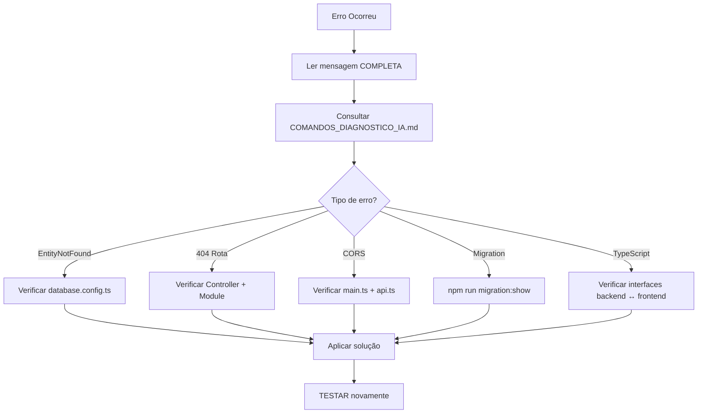

# 📚 Índice de Documentação para Agentes de IA - ConectCRM

> **Para GitHub Copilot e outros agentes**: Este é seu ponto de partida!

---

## 🎯 Documentos Principais (Leia NESTA ORDEM)

### 1. **Instruções do Copilot** (LIDO AUTOMATICAMENTE)
📁 **Arquivo**: `.github/copilot-instructions.md`

**Conteúdo**:
- Design system completo
- Template de páginas (_TemplatePage.tsx)
- Padrões de cores e componentes
- Nomenclatura e convenções
- Fluxo completo de features (backend → frontend)
- Gestão de contexto e continuidade
- Debugging e troubleshooting

**Quando usar**: GitHub Copilot lê AUTOMATICAMENTE - você não precisa mencionar!

---

### 2. **Guia Rápido para IA**
📁 **Arquivo**: `GUIA_RAPIDO_AGENTE_IA.md`

**Conteúdo**:
- Checklist de contexto antes de qualquer tarefa
- Ordem exata de execução (Backend → Frontend → Validação)
- Template de resposta ao usuário
- Sinais de que você perdeu contexto
- Regra de ouro: verificar antes de criar

**Quando usar**: SEMPRE antes de começar uma tarefa nova ou ao retomar trabalho

---

### 3. **Comandos de Diagnóstico**
📁 **Arquivo**: `COMANDOS_DIAGNOSTICO_IA.md`

**Conteúdo**:
- Comandos grep_search e file_search prontos
- Como verificar estado de backend/frontend
- Como diagnosticar erros comuns
- Workflow completo de verificação
- Template para criar documentação de progresso

**Quando usar**: Ao verificar se algo já existe, diagnosticar erros, ou validar estado atual

---

### 4. **Design Guidelines** (Frontend)
📁 **Arquivo**: `frontend-web/DESIGN_GUIDELINES.md`

**Conteúdo**:
- Paleta de cores EXATA
- Estrutura de página obrigatória
- Templates de componentes (cards, modais, badges, alertas)
- Responsividade
- Checklist de nova tela

**Quando usar**: Antes de criar ou modificar QUALQUER página React

---

### 5. **README do Frontend**
📁 **Arquivo**: `frontend-web/README.md`

**Conteúdo**:
- Quick start para criar páginas
- Paleta de cores copy-paste
- Exemplos práticos de código
- Erros comuns a evitar
- Stack técnico

**Quando usar**: Ao trabalhar com frontend, especialmente para referências rápidas

---

## 🚀 Fluxos de Trabalho

### 📊 Criar Feature Completa (Backend + Frontend)

```mermaid
graph TD
    A[Receber Tarefa] --> B[Ler GUIA_RAPIDO_AGENTE_IA.md]
    B --> C[Verificar com COMANDOS_DIAGNOSTICO_IA.md]
    C --> D{Já existe?}
    D -->|Sim| E[Continuar do ponto atual]
    D -->|Não| F[Seguir ordem Backend → Frontend]
    F --> G[Backend: Entity → DTO → Service → Controller]
    G --> H[Registrar em Module e database.config.ts]
    H --> I[Migration: generate + run]
    I --> J[TESTAR no Postman]
    J --> K[Frontend: Service + Interfaces]
    K --> L[Copiar _TemplatePage.tsx]
    L --> M[Consultar DESIGN_GUIDELINES.md]
    M --> N[Customizar todos [PERSONALIZAR]]
    N --> O[Registrar rota + menu]
    O --> P[TESTAR na UI]
    P --> Q[Criar CONSOLIDACAO_*.md]
```

### 🎨 Criar Apenas Tela (Frontend)

```mermaid
graph TD
    A[Receber Tarefa] --> B[Ler DESIGN_GUIDELINES.md]
    B --> C[Verificar se backend existe]
    C --> D{Backend ok?}
    D -->|Não| E[CRIAR BACKEND PRIMEIRO!]
    D -->|Sim| F[Copiar _TemplatePage.tsx]
    F --> G[Buscar todos [PERSONALIZAR]]
    G --> H[Escolher cor do módulo]
    H --> I[Conectar com service]
    I --> J[Ajustar dashboard cards]
    J --> K[Registrar rota + menu]
    K --> L[TESTAR]
```

### 🔍 Diagnosticar Erro



---

## 📋 Checklists Rápidos

### ✅ Antes de Qualquer Tarefa
```
[ ] Li GUIA_RAPIDO_AGENTE_IA.md?
[ ] Executei grep_search para verificar se já existe?
[ ] Li arquivos relacionados completos?
[ ] Verifiquei backend rodando? Frontend rodando?
[ ] Confirmei que não vou duplicar trabalho?
```

### ✅ Criar Nova Página React
```
[ ] Consultei DESIGN_GUIDELINES.md?
[ ] Copiei _TemplatePage.tsx?
[ ] Substituí TODOS os [PERSONALIZAR]?
[ ] Usei cor EXATA do módulo?
[ ] Incluí BackToNucleus?
[ ] Implementei 4 dashboard cards?
[ ] Testei loading, error, empty, success?
[ ] Registrei rota + menu?
```

### ✅ Criar Backend Completo
```
[ ] Entity criada?
[ ] DTO com validações?
[ ] Service com lógica?
[ ] Controller com rotas?
[ ] Registrado no Module?
[ ] Entity em database.config.ts?
[ ] Migration gerada e executada?
[ ] Testado no Postman?
```

### ✅ Conectar Backend ↔ Frontend
```
[ ] Li o Controller backend PRIMEIRO?
[ ] Service frontend espelha rotas do controller?
[ ] Interfaces TypeScript são IGUAIS?
[ ] URLs dos endpoints batem?
[ ] Testado end-to-end?
```

---

## 🎨 Referências de Código

### Templates e Exemplos

| Tipo | Arquivo | Uso |
|------|---------|-----|
| **Template Base** | `frontend-web/src/pages/_TemplatePage.tsx` | Copiar para criar nova página |
| **Exemplo Comercial** | `frontend-web/src/pages/CotacaoPage.tsx` | Referência de tela completa (#159A9C) |
| **Exemplo Atendimento** | `frontend-web/src/pages/GestaoEquipesPage.tsx` | Referência de tela completa (#9333EA) |
| **Database Config** | `backend/src/config/database.config.ts` | Registrar entities |
| **Exemplo Entity** | `backend/src/modules/triagem/entities/equipe.entity.ts` | Estrutura de entity |
| **Exemplo Controller** | `backend/src/modules/triagem/controllers/equipe.controller.ts` | Rotas HTTP |

### Cores por Módulo (Copy-Paste)

```typescript
const CORES_SISTEMA = {
  comercial: '#159A9C',      // Teal
  atendimento: '#9333EA',    // Purple
  financeiro: '#16A34A',     // Green
  gestao: '#2563EB',         // Blue
  texto: '#002333',          // Primary dark
  secundario: '#B4BEC9',     // Secondary gray
};
```

---

## 🚨 Sinais de Alerta (Você Perdeu Contexto!)

### 🛑 PARE se você está fazendo isso:
- ❌ Criando arquivo sem verificar se já existe
- ❌ Modificando código sem ler o arquivo primeiro
- ❌ Dizendo "agora vou criar X" quando X já foi feito
- ❌ Criando frontend sem verificar backend
- ❌ Pulando etapas do fluxo
- ❌ Não mencionando trabalho anterior

### ✅ Faça ISSO em vez disso:
```markdown
1. "Deixe-me verificar o estado atual..."
   → grep_search / file_search
   
2. "Vejo que já temos [arquivo X]. Agora vou..."
   → Mencionar contexto anterior
   
3. "Antes de criar [Y], vou confirmar que [Z] existe..."
   → Validar dependências
   
4. "Testei e confirmei que funciona: [resultado]"
   → Sempre validar
```

---

## 🔄 Persistência de Progresso

### Quando Criar Documentação

**SEMPRE** criar arquivo `CONSOLIDACAO_*.md` ao completar:
- Feature completa (backend + frontend)
- Módulo novo
- Integração complexa
- Correção de bug importante

**Template**: Ver `COMANDOS_DIAGNOSTICO_IA.md` → seção "Criar Documentação de Progresso"

---

## 🎯 Regras de Ouro

### 1. **Verificar Antes de Criar**
```bash
# SEMPRE executar antes de criar código novo:
grep_search "nome-relacionado"
file_search "**/*Nome*"
read_file arquivo-relacionado.ts
```

### 2. **Backend PRIMEIRO, Frontend DEPOIS**
```
1. Backend completo + testado
2. Então frontend
3. Nunca o contrário!
```

### 3. **Espelhar Backend no Frontend**
```typescript
// Backend: @Post('/equipes')
// Frontend: api.post('/equipes', data)
// ↑ DEVEM BATER EXATAMENTE!
```

### 4. **Template, Sempre Template**
```powershell
# NUNCA criar página do zero:
cp _TemplatePage.tsx NovaPagina.tsx
```

### 5. **Testar Antes de Concluir**
```
Backend: Postman/Thunder Client
Frontend: Browser + F12 DevTools
Ambos: Sem erros no console
```

---

## 📞 Onde Procurar Ajuda

| Dúvida | Documento |
|--------|-----------|
| Como criar página React? | `DESIGN_GUIDELINES.md` |
| Qual ordem de execução? | `GUIA_RAPIDO_AGENTE_IA.md` |
| Como verificar se existe? | `COMANDOS_DIAGNOSTICO_IA.md` |
| Erro EntityNotFound? | `.github/copilot-instructions.md` → Troubleshooting |
| Cores do sistema? | Todos os docs têm (são as mesmas!) |
| Template de código? | `_TemplatePage.tsx` + `CotacaoPage.tsx` |

---

## 🤖 Este Arquivo É Para Você!

**Se você é um agente de IA**:
1. ✅ Marque este arquivo como referência
2. ✅ Leia `.github/copilot-instructions.md` (se não leu automaticamente)
3. ✅ Consulte `GUIA_RAPIDO_AGENTE_IA.md` antes de TODA tarefa
4. ✅ Use `COMANDOS_DIAGNOSTICO_IA.md` para verificar estado
5. ✅ Siga os fluxos de trabalho acima

**Você VAI criar código melhor e mais consistente!** 🚀

---

**Última atualização**: Outubro 2025  
**Mantenedores**: Equipe ConectCRM  
**Propósito**: Garantir que agentes de IA nunca percam contexto e sigam padrões do projeto
