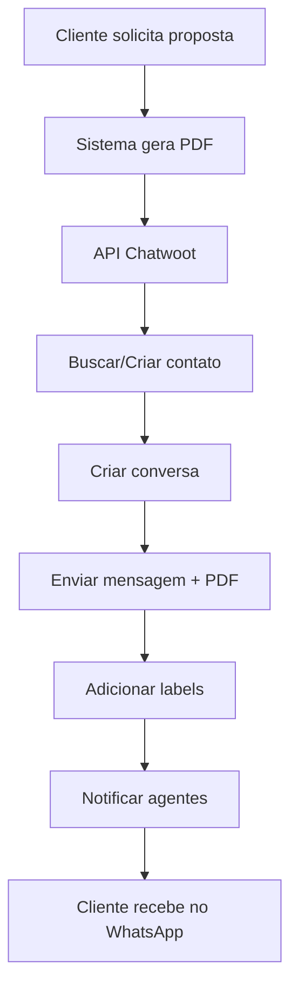

# 🎯 GUIA COMPLETO DE INSTALAÇÃO E CONFIGURAÇÃO DO CHATWOOT

## 📋 O que é Chatwoot?

**Chatwoot** é uma plataforma **OPEN SOURCE** de atendimento ao cliente que oferece:
- ✅ **100% GRATUITO** (auto-hospedado)
- 📱 **Multi-canal**: WhatsApp, Email, Chat Web, Facebook, etc.
- 🤖 **AI Agent "Captain"** integrado
- 📊 **Reports e Analytics** completos
- 👥 **Sistema de agentes** e atribuição
- 🔗 **API robusta** para integrações

---

## 🚀 INSTALAÇÃO DO CHATWOOT

### 🐳 **Opção 1: Docker (Recomendado)**

```bash
# 1. Clonar repositório
git clone https://github.com/chatwoot/chatwoot.git
cd chatwoot

# 2. Configurar variáveis de ambiente
cp .env.example .env

# 3. Editar configurações principais
nano .env
```

**Principais configurações do .env:**
```bash
# URL onde o Chatwoot vai rodar
FRONTEND_URL=http://localhost:3000

# Configurações do banco
POSTGRES_USERNAME=postgres
POSTGRES_PASSWORD=sua_senha_aqui
POSTGRES_DATABASE=chatwoot_production

# Redis (para cache)
REDIS_URL=redis://redis:6379

# SMTP para emails (opcional)
SMTP_DOMAIN=localhost
SMTP_PORT=587
SMTP_USERNAME=
SMTP_PASSWORD=

# Storage (opcional - para arquivos)
ACTIVE_STORAGE_SERVICE=local
```

```bash
# 4. Executar com Docker
docker-compose up -d

# 5. Executar migrations
docker-compose exec rails rails db:create
docker-compose exec rails rails db:reset
```

### ☁️ **Opção 2: Deploy na Cloud (1-Click)**

#### **Heroku** (Gratuito)
[](https://heroku.com/deploy?template=https://github.com/chatwoot/chatwoot)

#### **DigitalOcean** (1-Click)
https://marketplace.digitalocean.com/apps/chatwoot

#### **Railway** (Gratuito)
[](https://railway.app/new/template/chatwoot)

---

## ⚙️ CONFIGURAÇÃO INICIAL

### 1. **Primeiro Acesso**
```
URL: http://localhost:3000
Criar conta administrativa
```

### 2. **Configurar Conta**
- Acessar painel admin
- Criar sua primeira conta (Account)
- Configurar dados da empresa

### 3. **Configurar WhatsApp**

#### **A) WhatsApp Cloud API (Oficial Meta)**
```
1. Ir em Settings > Inboxes > Add Inbox
2. Escolher "WhatsApp"
3. Selecionar "WhatsApp Cloud API"
4. Seguir wizard de configuração:
   - App ID do Facebook
   - App Secret
   - Phone Number ID
   - Access Token
```

#### **B) 360Dialog (Provedor)**
```
1. Criar conta em 360dialog.com
2. Obter Partner ID e Token
3. Configurar no Chatwoot:
   - Provider: 360Dialog
   - Partner ID: seu_partner_id
   - Token: seu_token
```

### 4. **Criar Agentes**
```
Settings > Team > Agents
- Adicionar usuários
- Definir funções (Admin/Agent)
- Configurar permissões
```

---

## 🔧 INTEGRAÇÃO COM NOSSO SISTEMA

### 1. **Obter Credenciais da API**
```
Settings > Applications > API Access Tokens
- Criar novo token
- Copiar o Access Token
- Anotar Account ID e Inbox ID
```

### 2. **Configurar .env do nosso Backend**
```bash
# Adicionar ao .env do nosso projeto
CHATWOOT_BASE_URL=http://localhost:3000
CHATWOOT_ACCESS_TOKEN=seu_access_token_aqui
CHATWOOT_ACCOUNT_ID=1
CHATWOOT_INBOX_ID=1
```

### 3. **Testar Integração**
```bash
# Instalar dependências
npm install axios

# Testar conexão
curl -X GET \
  "http://localhost:3000/api/v1/accounts/1/profile" \
  -H "Authorization: Bearer SEU_TOKEN"
```

---

## 🔄 WORKFLOW DE ENVIO DE PROPOSTAS



### **Vantagens sobre WhatsApp Web.js:**

| Recurso | WhatsApp Web.js | **Chatwoot** |
|---------|-----------------|--------------|
| **Interface** | ❌ Terminal | ✅ **Interface Web Completa** |
| **Multi-usuário** | ❌ Não | ✅ **Múltiplos agentes** |
| **Histórico** | ⚠️ Limitado | ✅ **Banco de dados completo** |
| **Reports** | ❌ Nenhum | ✅ **Analytics avançados** |
| **Multi-canal** | ❌ Só WhatsApp | ✅ **Todos os canais** |
| **Estabilidade** | ⚠️ Instável | ✅ **Produção enterprise** |
| **Automação** | ⚠️ Básica | ✅ **AI + Workflows** |
| **Compliance** | ❌ Informal | ✅ **API oficial Meta** |

---

## 📱 FUNCIONALIDADES PRINCIPAIS

### **1. Dashboard Unificado**
- Todas as conversas em um lugar
- Status em tempo real
- Métricas de desempenho
- Notificações push

### **2. Sistema de Agentes**
- Atribuição automática/manual
- Status online/offline
- Capacidade por agente
- Hierarquia de permissões

### **3. Automações**
- Respostas automáticas
- Regras de roteamento
- Integração com IA
- Workflows customizados

### **4. Reports & Analytics**
- Tempo de resposta
- Taxa de resolução
- Volume de conversas
- Performance por agente
- Satisfação do cliente

---

## 🔒 CONFIGURAÇÕES DE SEGURANÇA

### **1. Variáveis de Ambiente Sensíveis**
```bash
# Gerar chaves seguras
SECRET_KEY_BASE=$(openssl rand -hex 64)
RAILS_ENV=production

# SSL (produção)
FORCE_SSL=true
```

### **2. Rate Limiting**
```bash
# Configurar limites de API
RATE_LIMIT_ENABLED=true
RATE_LIMIT_REQUESTS_PER_HOUR=1000
```

### **3. CORS**
```bash
# Configurar domínios permitidos
CORS_ORIGINS=https://seudominio.com,http://localhost:3900
```

---

## 📊 MONITORAMENTO

### **1. Health Check**
```bash
# Endpoint de saúde
GET /api/v1/health

# Response
{
  "status": "ok",
  "database": "connected",
  "redis": "connected"
}
```

### **2. Logs**
```bash
# Acompanhar logs
docker-compose logs -f rails

# Logs por serviço
docker-compose logs -f sidekiq  # Workers
docker-compose logs -f postgres # Banco
docker-compose logs -f redis    # Cache
```

---

## 🚀 DEPLOYMENT EM PRODUÇÃO

### **1. Domínio e SSL**
```bash
# Configurar Nginx
server {
    listen 443 ssl;
    server_name chat.seudominio.com;
    
    ssl_certificate /path/to/cert.pem;
    ssl_certificate_key /path/to/key.pem;
    
    location / {
        proxy_pass http://localhost:3000;
        proxy_set_header Host $host;
        proxy_set_header X-Real-IP $remote_addr;
    }
}
```

### **2. Backup Automático**
```bash
# Script de backup diário
#!/bin/bash
pg_dump chatwoot_production > backup_$(date +%Y%m%d).sql
aws s3 cp backup_*.sql s3://seu-bucket/backups/
```

### **3. Escalabilidade**
```yaml
# docker-compose.prod.yml
services:
  rails:
    deploy:
      replicas: 3
  sidekiq:
    deploy:
      replicas: 2
```

---

## ❓ TROUBLESHOOTING

### **Problemas Comuns:**

#### **1. Erro de conexão com WhatsApp**
```bash
# Verificar webhook
curl -X GET "https://graph.facebook.com/v17.0/PHONE_NUMBER_ID/webhooks"

# Re-configurar webhook
Settings > Inboxes > [Sua inbox] > Configuration
```

#### **2. Performance lenta**
```bash
# Verificar Redis
redis-cli ping

# Verificar PostgreSQL
docker-compose exec postgres psql -U postgres -c "SELECT count(*) FROM conversations;"
```

#### **3. Erro de permissões**
```bash
# Verificar tokens
curl -H "Authorization: Bearer TOKEN" \
  "http://localhost:3000/api/v1/accounts/1/profile"
```

---

## 🎯 PRÓXIMOS PASSOS

1. ✅ **Instalar Chatwoot** (Docker/Cloud)
2. ✅ **Configurar WhatsApp** (Cloud API)
3. ✅ **Integrar com nosso sistema** (API tokens)
4. ✅ **Testar envio de propostas**
5. ✅ **Treinar equipe** (interface web)
6. ✅ **Configurar automações**
7. ✅ **Deploy em produção**

---

## 🔗 RECURSOS ÚTEIS

- **Documentação oficial**: https://www.chatwoot.com/docs/
- **GitHub**: https://github.com/chatwoot/chatwoot
- **API Reference**: https://www.chatwoot.com/developers/api/
- **Community**: https://github.com/chatwoot/chatwoot/discussions
- **Telegram Group**: https://t.me/chatwoot

---

**🎉 RESULTADO FINAL:**
- ✅ Sistema profissional de atendimento
- ✅ Envio automático de propostas por WhatsApp
- ✅ Interface web completa para agentes
- ✅ Histórico e analytics completos
- ✅ Multi-canal (WhatsApp + Email + Chat)
- ✅ 100% gratuito e open source
