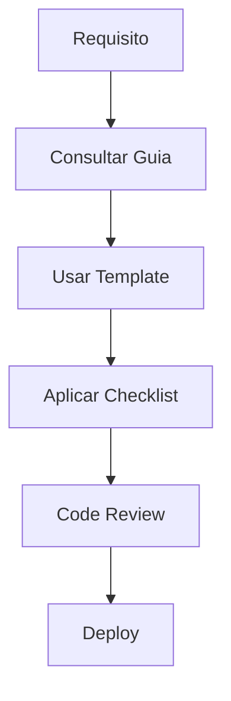
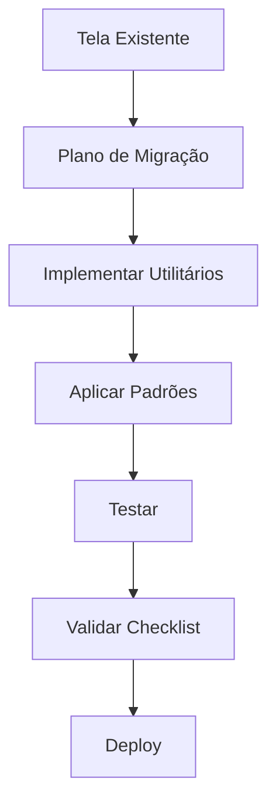

# 📚 Índice da Documentação - Padrões de Desenvolvimento ConectCRM

## 🎯 Visão Geral

Esta documentação estabelece padrões completos para desenvolvimento de interfaces no ConectCRM, evitando problemas como formatação incorreta de valores monetários, UX inconsistente e retrabalho desnecessário.

---

## 📋 Documentos Principais

### 1️⃣ **[GUIA_REQUISITOS_DESENVOLVIMENTO_TELAS.md](./GUIA_REQUISITOS_DESENVOLVIMENTO_TELAS.md)**

**📖 Guia Completo de Requisitos**

- Padrões de arquitetura e estrutura
- Formatação obrigatória de valores monetários
- Componentes e funcionalidades obrigatórias
- Estados da interface (loading, erro, vazio)
- Padrões de design e responsividade
- Performance e otimização
- Testes e qualidade

### 2️⃣ **[CHECKLIST_DESENVOLVIMENTO_TELAS.md](./CHECKLIST_DESENVOLVIMENTO_TELAS.md)**

**✅ Checklist Prático para Desenvolvimento**

- Lista de verificação antes de começar
- Template para formatação monetária
- Verificações obrigatórias por seção
- Checklist final antes do merge
- Problemas comuns para evitar
- Dúvidas frequentes e soluções

### 3️⃣ **[TEMPLATE_NOVA_TELA.tsx](./TEMPLATE_NOVA_TELA.tsx)**

**🏗️ Template de Código Reutilizável**

- Estrutura base para novas telas
- Implementação dos padrões obrigatórios
- Código pronto para copiar e adaptar
- Comentários TODO para personalização
- Exemplo de hooks e formatação

### 4️⃣ **[HOOKS_UTILITARIOS_ESSENCIAIS.md](./HOOKS_UTILITARIOS_ESSENCIAIS.md)**

**🔧 Hooks e Utilitários para Reutilização**

- Hook `useDebounce` para buscas
- Hook `useEntidade` para gerenciamento de dados
- Hook `useFormulario` para modais complexos
- Utilitários de formatação monetária
- Componentes comuns (CardResumo, LoadingSpinner, etc.)

### 5️⃣ **[PLANO_MIGRACAO_PADROES.md](./PLANO_MIGRACAO_PADROES.md)**

**🔄 Plano de Migração de Telas Existentes**

- Análise do estado atual do sistema
- Cronograma de migração por fases
- Critérios de aceitação
- Plano de testes
- Métricas de sucesso e riscos

---

## 🚀 Como Usar Esta Documentação

### 👨‍💻 Para Desenvolvedores

#### **Criando Nova Tela**

1. 📋 Consultar o **[Checklist](./CHECKLIST_DESENVOLVIMENTO_TELAS.md)** antes de começar
2. 🏗️ Copiar o **[Template](./TEMPLATE_NOVA_TELA.tsx)** como base
3. 🔧 Usar **[Hooks e Utilitários](./HOOKS_UTILITARIOS_ESSENCIAIS.md)** para funcionalidades comuns
4. 📖 Seguir **[Guia de Requisitos](./GUIA_REQUISITOS_DESENVOLVIMENTO_TELAS.md)** para detalhes específicos

#### **Migrando Tela Existente**

1. 🔄 Seguir **[Plano de Migração](./PLANO_MIGRACAO_PADROES.md)**
2. ✅ Usar **[Checklist](./CHECKLIST_DESENVOLVIMENTO_TELAS.md)** para validação
3. 🔧 Implementar **[Hooks e Utilitários](./HOOKS_UTILITARIOS_ESSENCIAIS.md)**
4. 📖 Consultar **[Guia de Requisitos](./GUIA_REQUISITOS_DESENVOLVIMENTO_TELAS.md)** para padrões

### 👥 Para Tech Leads

#### **Planejamento de Projeto**

1. 🔄 Usar **[Plano de Migração](./PLANO_MIGRACAO_PADROES.md)** para estimar esforço
2. 📖 Definir requisitos baseado no **[Guia](./GUIA_REQUISITOS_DESENVOLVIMENTO_TELAS.md)**
3. ✅ Estabelecer **[Checklist](./CHECKLIST_DESENVOLVIMENTO_TELAS.md)** como critério de aceite

#### **Code Review**

1. ✅ Usar **[Checklist](./CHECKLIST_DESENVOLVIMENTO_TELAS.md)** como base
2. 📖 Validar conformidade com **[Guia de Requisitos](./GUIA_REQUISITOS_DESENVOLVIMENTO_TELAS.md)**
3. 🔧 Verificar uso dos **[Hooks e Utilitários](./HOOKS_UTILITARIOS_ESSENCIAIS.md)**

### 🎯 Para Product Owners

#### **Definição de Funcionalidades**

1. 📖 Usar **[Guia de Requisitos](./GUIA_REQUISITOS_DESENVOLVIMENTO_TELAS.md)** para especificar UX
2. 🔄 Considerar **[Plano de Migração](./PLANO_MIGRACAO_PADROES.md)** para estimar cronograma
3. ✅ Incluir **[Checklist](./CHECKLIST_DESENVOLVIMENTO_TELAS.md)** nos critérios de aceite

---

## 🎯 Objetivos Alcançados

### ✅ **Zero Retrabalho**

- Formatação monetária correta desde o primeiro desenvolvimento
- UX consistente em todas as telas
- Padrões claros e bem documentados

### ✅ **Produtividade**

- Template pronto para copy/paste
- Hooks reutilizáveis para funcionalidades comuns
- Checklist prático para desenvolvimento ágil

### ✅ **Qualidade**

- Padrões profissionais estabelecidos
- Critérios objetivos de qualidade
- Plano de migração estruturado

### ✅ **Manutenibilidade**

- Código padronizado e reutilizável
- Documentação sempre atualizada
- Hooks e utilitários centralizados

---

## 📊 Estatísticas da Documentação

### 📝 **Conteúdo Criado**

- **5 documentos** principais
- **1 template** de código pronto
- **15+ funções** utilitárias
- **3 hooks** customizados
- **4 componentes** reutilizáveis

### 🔧 **Funcionalidades Cobertas**

- ✅ Formatação monetária brasileira
- ✅ Estados de interface (loading, erro, vazio)
- ✅ Responsividade (mobile, tablet, desktop)
- ✅ Performance (memoização, lazy loading)
- ✅ Validações (email, CPF, CNPJ)
- ✅ Componentes profissionais (cards, modais, filtros)

### 📋 **Checklists e Processos**

- **50+ itens** de verificação
- **4 fases** de migração estruturadas
- **20+ testes** automatizados sugeridos
- **10+ métricas** de qualidade definidas

---

## 🔄 Fluxo de Trabalho Recomendado

### 🚀 **Nova Feature**

### 🔧 **Migração**

---

## 📞 Suporte e Atualizações

### 🆘 **Quando Surgir Dúvida**

1. **Consultar índice** para encontrar documento relevante
2. **Buscar no checklist** por problema específico
3. **Verificar template** para exemplo de implementação
4. **Consultar hooks/utilitários** para funcionalidade pronta

### 🔄 **Atualizações dos Documentos**

- **Sempre documentar** novas soluções encontradas
- **Atualizar checklist** com novos itens identificados
- **Expandir utilitários** conforme necessidade
- **Refinar processos** baseado na experiência

### 🎯 **Melhoria Contínua**

- **Feedback da equipe** incorporado aos processos
- **Métricas de qualidade** monitoradas
- **Padrões evoluem** com melhores práticas
- **Documentação viva** sempre atualizada

---

## 🏆 Resultados Esperados

### 📈 **Curto Prazo (1-2 meses)**

- ✅ 100% das novas telas seguindo padrões
- ✅ 0 problemas de formatação monetária
- ✅ 50% redução no tempo de desenvolvimento
- ✅ 90% conformidade no code review

### 🚀 **Médio Prazo (3-6 meses)**

- ✅ 80% das telas existentes migradas
- ✅ Biblioteca de componentes consolidada
- ✅ Performance 30% melhorada
- ✅ 95% satisfação da equipe de desenvolvimento

### 🎯 **Longo Prazo (6+ meses)**

- ✅ Sistema completamente padronizado
- ✅ Zero retrabalho por problemas de formatação
- ✅ Onboarding de novos desenvolvedores 70% mais rápido
- ✅ Codebase reconhecido como referência de qualidade

---

## 📚 **Navegação Rápida**

| Preciso de...            | Consultar                                                                                        |
| ------------------------ | ------------------------------------------------------------------------------------------------ |
| 🆕 Criar nova tela       | **[Template](./TEMPLATE_NOVA_TELA.tsx)** + **[Checklist](./CHECKLIST_DESENVOLVIMENTO_TELAS.md)** |
| 🔧 Migrar tela existente | **[Plano de Migração](./PLANO_MIGRACAO_PADROES.md)**                                             |
| 💰 Formatação monetária  | **[Hooks e Utilitários](./HOOKS_UTILITARIOS_ESSENCIAIS.md)**                                     |
| 📋 Validar qualidade     | **[Checklist](./CHECKLIST_DESENVOLVIMENTO_TELAS.md)**                                            |
| 📖 Entender padrões      | **[Guia de Requisitos](./GUIA_REQUISITOS_DESENVOLVIMENTO_TELAS.md)**                             |
| 🔄 Planejar projeto      | **[Plano de Migração](./PLANO_MIGRACAO_PADROES.md)**                                             |

---

_📅 Documentação criada em: Dezembro 2024_  
_📝 Status: ✅ Completa e pronta para uso_  
_🎯 Objetivo: Zero retrabalho + Máxima produtividade_  
_👥 Público: Desenvolvedores, Tech Leads, Product Owners_
