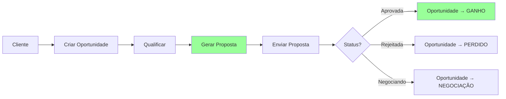
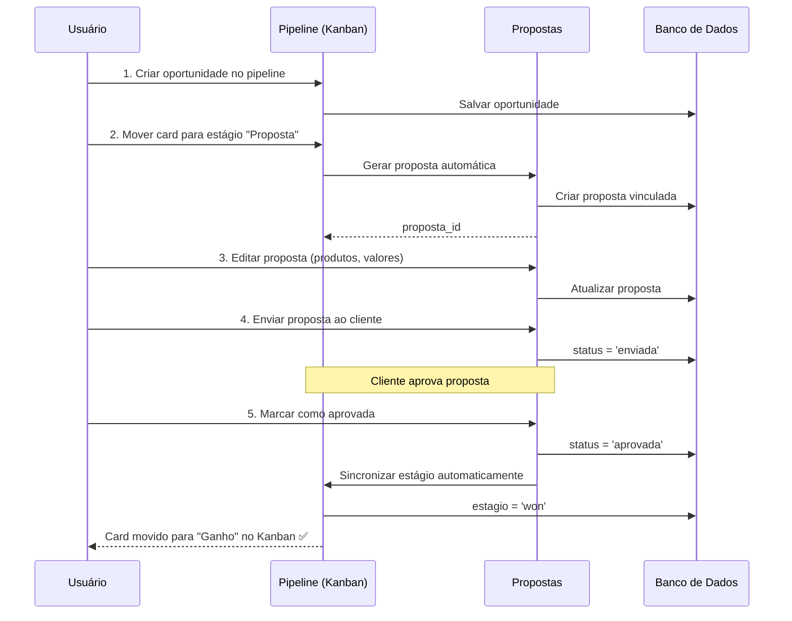
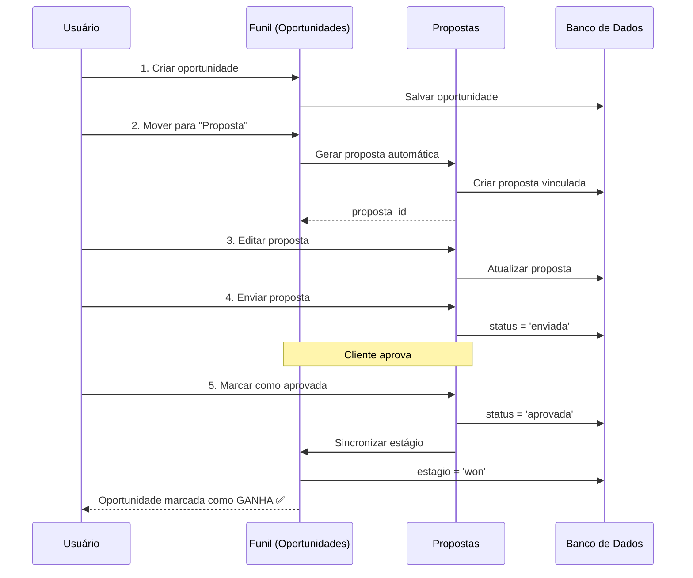

# 📊 Análise: Alinhamento entre Propostas e Pipeline de Vendas

**Data**: 02 de Dezembro de 2025  
**Status Atual**: ⚠️ **DESALINHADO - Necessita Integração**

> **📌 CORREÇÃO**: O sistema usa o nome "**Pipeline de Vendas**" (não "Funil de Vendas")  
> **Tela Real**: `PipelinePage.tsx` → Rota `/pipeline` → Menu "Pipeline de Vendas" (badge: Completo)

---

## 🔍 Resumo Executivo

Após análise detalhada do código, **a tela de propostas e o pipeline de vendas NÃO estão completamente alinhados**. Existem dois sistemas paralelos que deveriam estar integrados:

### ❌ Problemas Identificados

1. **Módulos Isolados**: Propostas e Oportunidades funcionam de forma independente
2. **Sem Integração**: Não há conexão entre criar proposta e movimentar no funil
3. **Dados Duplicados**: Informações similares em duas bases diferentes
4. **Fluxo Quebrado**: Cliente não flui automaticamente entre os sistemas

---

## 📋 Estado Atual dos Módulos

### 1️⃣ Módulo de Propostas

**Localização Backend**: `backend/src/modules/propostas/`

**Entity**: `proposta.entity.ts`
```typescript
@Entity('propostas')
export class Proposta {
  @Column({ enum: ['rascunho', 'enviada', 'visualizada', 'aprovada', 'rejeitada', 'expirada'] })
  status: string;
  
  @Column('jsonb')
  cliente: ClienteProposta;
  
  @Column('decimal')
  total: number;
  
  @Column({ nullable: true })
  vendedor_id: string;
  
  // ❌ NÃO TEM: oportunidade_id (relação com funil)
  // ❌ NÃO TEM: estagio (para sincronizar com funil)
}
```

**Status da Proposta**:
- ✅ `rascunho` → proposta em criação
- ✅ `enviada` → enviada ao cliente
- ✅ `visualizada` → cliente abriu
- ✅ `aprovada` → cliente aceitou
- ✅ `rejeitada` → cliente recusou
- ✅ `expirada` → prazo vencido

### 2️⃣ Módulo de Oportunidades (Pipeline de Vendas)

**Localização Backend**: `backend/src/modules/oportunidades/`  
**Localização Frontend**: `frontend-web/src/pages/PipelinePage.tsx`  
**Rota**: `/pipeline` (Menu: "Pipeline de Vendas" - badge "Completo")

**Entity**: `oportunidade.entity.ts`
```typescript
export enum EstagioOportunidade {
  LEADS = 'leads',
  QUALIFICACAO = 'qualification',
  PROPOSTA = 'proposal',          // ⚠️ TEM estágio "proposta"
  NEGOCIACAO = 'negotiation',
  FECHAMENTO = 'closing',
  GANHO = 'won',
  PERDIDO = 'lost',
}

@Entity('oportunidades')
export class Oportunidade {
  @Column({ enum: EstagioOportunidade })
  estagio: EstagioOportunidade;
  
  @Column('decimal')
  valor: number;
  
  @ManyToOne(() => Cliente)
  cliente: Cliente;
  
  @Column('varchar')
  responsavel_id: string;
  
  // ❌ NÃO TEM: proposta_id (relação com proposta)
  // ❌ NÃO TEM: sincronização automática com propostas
}
**Estágios do Pipeline** (visual Kanban drag-and-drop):
- ✅ Leads → novo contato (cinza - `bg-slate-500`)
- ✅ Qualificação → validando fit (azul - `bg-blue-500`)
- ✅ **Proposta** → proposta enviada (amarelo - `bg-yellow-500`) **← DEVERIA conectar!**
- ✅ Negociação → discutindo termos (laranja - `bg-orange-500`)
- ✅ Fechamento → finalizando (roxo - `bg-purple-500`)
- ✅ Ganho → vendido (verde - `bg-green-500`)
- ✅ Perdido → não vendido (vermelho - `bg-red-500`)ndo
- ✅ Ganho → vendido
- ✅ Perdido → não vendido

---

## ⚠️ Desalinhamentos Críticos

### 1. **Sem Relacionamento entre Entities**

```typescript
// ❌ PROBLEMA: Não há FK entre proposta e oportunidade

// Em proposta.entity.ts
// FALTA: 
@ManyToOne(() => Oportunidade)
@JoinColumn({ name: 'oportunidade_id' })
oportunidade: Oportunidade;

@Column('int', { nullable: true })
oportunidade_id: number;
```

### 2. **Workflows Separados**

#### Workflow Atual (ERRADO):

```mermaid
graph LR
    A[Cliente] --> B[Criar Oportunidade]
    A --> C[Criar Proposta]
    B --> D[Mover no Funil]
    C --> E[Enviar Proposta]
    D -.x E
    E -.x D
    style D fill:#f99
    style E fill:#f99
```

❌ Criar oportunidade e proposta são processos separados  
❌ Mover oportunidade no funil não afeta proposta  
❌ Aprovar proposta não move oportunidade  

#### Workflow Ideal (CORRETO):



### 3. **Frontend Desconectado**

**Pipeline de Vendas** (`PipelinePage.tsx` - `/pipeline`):
- ✅ Exibe oportunidades por estágio em Kanban visual
- ✅ Drag & drop entre estágios com animações
- ✅ 4 visualizações: Kanban, Lista, Calendário, Gráfico
- ✅ Métricas: Total oportunidades, valor pipeline, taxa conversão, ticket médio
- ✅ Filtros avançados: responsável, prioridade, origem, período
- ❌ Não lista propostas associadas a cada oportunidade
**Tela de Propostas** (`PropostasPage.tsx` - `/propostas`):
- ✅ Lista todas as propostas com filtros
- ✅ Cria novas propostas (modal completo)
- ✅ Atualiza status (rascunho → enviada → aprovada)
- ✅ Gera PDF da proposta
- ✅ Envia por email
- ✅ Dashboard com métricas (total, pipeline, conversão, ticket médio)
- ✅ Ações em massa (exportar, aprovar múltiplas)
- ❌ Não mostra qual oportunidade do pipeline originou a proposta
- ❌ Não move oportunidade automaticamente quando aprovar proposta
- ❌ Não está visível no pipeline visual (Kanban)o → enviada → aprovada)
- ❌ Não mostra qual oportunidade originou
- ❌ Não move oportunidade quando aprovar proposta
- ❌ Não está no funil visual

### 4. **Dados Duplicados**

Ambos os módulos armazenam:
- Cliente (nome, email, telefone)
- Valor da negociação
- Status/Estágio
- Responsável/Vendedor
- Data de criação

⚠️ **Problema**: Dessincronia entre as duas bases!

---

## ✅ Soluções Necessárias

### Fase 1: Integração Backend (CRÍTICO)

#### 1.1. Adicionar Relacionamento nas Entities

**Arquivo**: `backend/src/modules/propostas/proposta.entity.ts`

```typescript
import { Oportunidade } from '../oportunidades/oportunidade.entity';

@Entity('propostas')
export class Proposta {
  // ... campos existentes ...
  
  // ✅ ADICIONAR:
  @ManyToOne(() => Oportunidade, { nullable: true })
  @JoinColumn({ name: 'oportunidade_id' })
  oportunidade: Oportunidade;
  
  @Column('int', { nullable: true })
  oportunidade_id: number;
}
```

**Arquivo**: `backend/src/modules/oportunidades/oportunidade.entity.ts`

```typescript
import { Proposta } from '../propostas/proposta.entity';

@Entity('oportunidades')
export class Oportunidade {
  // ... campos existentes ...
  
  // ✅ ADICIONAR:
  @OneToMany(() => Proposta, (proposta) => proposta.oportunidade)
  propostas: Proposta[];
}
```

#### 1.2. Migration para Adicionar Coluna

**Arquivo**: `backend/src/migrations/YYYYMMDDHHMMSS-add-oportunidade-to-proposta.ts`

```typescript
import { MigrationInterface, QueryRunner } from 'typeorm';

export class AddOportunidadeToProposta1733166000000 implements MigrationInterface {
  public async up(queryRunner: QueryRunner): Promise<void> {
    await queryRunner.query(`
      ALTER TABLE "propostas" 
      ADD COLUMN "oportunidade_id" INTEGER NULL;
    `);
    
    await queryRunner.query(`
      ALTER TABLE "propostas" 
      ADD CONSTRAINT "FK_propostas_oportunidade" 
      FOREIGN KEY ("oportunidade_id") 
      REFERENCES "oportunidades"("id") 
      ON DELETE SET NULL;
    `);
  }

  public async down(queryRunner: QueryRunner): Promise<void> {
    await queryRunner.query(`
      ALTER TABLE "propostas" 
      DROP CONSTRAINT "FK_propostas_oportunidade";
    `);
    
    await queryRunner.query(`
      ALTER TABLE "propostas" 
      DROP COLUMN "oportunidade_id";
    `);
  }
}
```

#### 1.3. Service: Sincronização Automática de Status

**Arquivo**: `backend/src/modules/propostas/propostas.service.ts`

```typescript
import { OportunidadesService } from '../oportunidades/oportunidades.service';
import { EstagioOportunidade } from '../oportunidades/oportunidade.entity';

@Injectable()
export class PropostasService {
  constructor(
    @InjectRepository(Proposta)
    private propostaRepository: Repository<Proposta>,
    // ✅ ADICIONAR:
    private oportunidadesService: OportunidadesService,
  ) {}
  
  async atualizarStatus(
    propostaId: string,
    status: string,
    source?: string,
    observacoes?: string,
  ): Promise<Proposta> {
    const proposta = await this.propostaRepository.findOne({
      where: { id: propostaId },
      relations: ['oportunidade'],
    });
    
    if (!proposta) {
      throw new Error(`Proposta com ID ${propostaId} não encontrada`);
    }
    
    // Atualizar status da proposta
    proposta.status = status;
    if (source) proposta.source = source;
    if (observacoes) proposta.observacoes = observacoes;
    
    // ✅ SINCRONIZAR com oportunidade
    if (proposta.oportunidade_id) {
      await this.sincronizarComOportunidade(proposta);
    }
    
    const propostaAtualizada = await this.propostaRepository.save(proposta);
    return this.entityToInterface(propostaAtualizada);
  }
  
  // ✅ NOVA FUNÇÃO: Sincronização bidirecional
  private async sincronizarComOportunidade(proposta: Proposta): Promise<void> {
    const mapeamentoStatus: Record<string, EstagioOportunidade> = {
      'rascunho': EstagioOportunidade.PROPOSTA,
      'enviada': EstagioOportunidade.PROPOSTA,
      'visualizada': EstagioOportunidade.PROPOSTA,
      'aprovada': EstagioOportunidade.GANHO,
      'rejeitada': EstagioOportunidade.PERDIDO,
      'expirada': EstagioOportunidade.PERDIDO,
    };
    
    const novoEstagio = mapeamentoStatus[proposta.status];
    
    if (novoEstagio) {
      await this.oportunidadesService.updateStage(
        proposta.oportunidade_id,
        novoEstagio,
      );
      
      console.log(
        `✅ Oportunidade ${proposta.oportunidade_id} movida para: ${novoEstagio}`
      );
    }
  }
}
```

#### 1.4. Service: Criar Proposta a Partir de Oportunidade

**Arquivo**: `backend/src/modules/oportunidades/oportunidades.service.ts`

```typescript
import { PropostasService } from '../propostas/propostas.service';

@Injectable()
export class OportunidadesService {
  constructor(
    @InjectRepository(Oportunidade)
    private oportunidadeRepository: Repository<Oportunidade>,
    // ✅ ADICIONAR:
    @Inject(forwardRef(() => PropostasService))
    private propostasService: PropostasService,
  ) {}
  
  // ✅ NOVA FUNÇÃO: Gerar proposta de oportunidade
  async gerarProposta(oportunidadeId: number): Promise<any> {
    const oportunidade = await this.oportunidadeRepository.findOne({
      where: { id: oportunidadeId },
      relations: ['cliente', 'responsavel'],
    });
    
    if (!oportunidade) {
      throw new NotFoundException('Oportunidade não encontrada');
    }
    
    // Criar proposta automaticamente
    const dadosProposta = {
      titulo: oportunidade.titulo,
      cliente: {
        id: oportunidade.cliente?.id,
        nome: oportunidade.cliente?.nome || oportunidade.nomeContato,
        email: oportunidade.cliente?.email || oportunidade.emailContato,
        telefone: oportunidade.cliente?.telefone || oportunidade.telefoneContato,
      },
      produtos: [],
      total: oportunidade.valor,
      valor: oportunidade.valor,
      formaPagamento: 'avista',
      validadeDias: 30,
      vendedor: oportunidade.responsavel,
      oportunidade_id: oportunidade.id, // ✅ VINCULAR
    };
    
    const proposta = await this.propostasService.criarProposta(dadosProposta);
    
    // Mover oportunidade para estágio "Proposta"
    await this.updateStage(oportunidadeId, EstagioOportunidade.PROPOSTA);
    
    return proposta;
  }
}
```

#### 1.5. Controller: Endpoint para Gerar Proposta

**Arquivo**: `backend/src/modules/oportunidades/oportunidades.controller.ts`

```typescript
@Controller('oportunidades')
export class OportunidadesController {
  // ... endpoints existentes ...
  
  // ✅ ADICIONAR:
  @Post(':id/gerar-proposta')
  async gerarProposta(
    @Param('id') id: string,
    @Request() req,
  ) {
    const empresaId = req.user.empresaId;
    const proposta = await this.oportunidadesService.gerarProposta(+id);
    
    return {
      success: true,
      message: 'Proposta gerada com sucesso',
      proposta,
    };
  }
#### 2.1. Adicionar Botão "Gerar Proposta" no Pipeline

**Arquivo**: `frontend-web/src/pages/PipelinePage.tsx`

```tsx
// Dentro do card de oportunidade (aproximadamente linha 1650)
// Adicionar botão nas ações do card:

<div className="flex items-center justify-between mt-3 pt-3 border-t border-gray-100">
  {/* Botões existentes (Editar, Deletar) */}
  <div className="flex gap-2">
    <button
      onClick={() => handleEditarOportunidade(oportunidade)}
      className="p-1 text-gray-400 hover:text-blue-600 transition-colors"
      title="Editar"
    >
      <Edit2 className="h-4 w-4" />
    </button>
    
    {/* ✅ ADICIONAR: Botão Gerar Proposta */}
    {oportunidade.estagio === EstagioOportunidade.PROPOSTA && (
      <button
        onClick={() => handleGerarProposta(oportunidade)}
        className="flex items-center gap-1 px-2 py-1 text-xs bg-[#159A9C] text-white rounded hover:bg-[#0F7B7D] transition-colors"
        title="Gerar Proposta Comercial"
      >
        <FileText className="h-3 w-3" />
        Gerar Proposta
      </button>
    )}
  </div>
</div>

#### 2.2. Mostrar Oportunidade Vinculada na Tela de Propostas

**Arquivo**: `frontend-web/src/features/propostas/PropostasPage.tsx`

**Local**: Adicionar coluna na tabela de propostas (aproximadamente linha 1200-1400)

```tsx
// Adicionar coluna "Pipeline" na tabela de propostas
<td className="px-6 py-4 whitespace-nowrap">
  {proposta.oportunidade ? (
    <a
      href={`/pipeline?oportunidade=${proposta.oportunidade.id}`}
      className="text-[#159A9C] hover:underline flex items-center gap-2"
      title="Ver no Pipeline de Vendas"
    >
      <Target className="h-4 w-4" />
      <div>
        <div className="font-medium">{proposta.oportunidade.titulo}</div>
        <div className="text-xs text-gray-500">
          Estágio: {mapearEstagioParaLabel(proposta.oportunidade.estagio)}
        </div>
#### 2.3. Badge de Sincronização no Card da Proposta

**Arquivo**: `frontend-web/src/features/propostas/PropostasPage.tsx`

**Local**: Dentro do card de cada proposta (linha ~1000-1200)

```tsx
// No header do card da proposta, adicionar badge de vínculo
<div className="flex items-center justify-between mb-2">
  <h3 className="text-lg font-semibold text-gray-900">
    {proposta.numero}
  </h3>
  
  {/* ✅ ADICIONAR: Badge de vínculo com pipeline */}
  <div className="flex items-center gap-2">
    {proposta.oportunidade && (
      <span className="inline-flex items-center px-2 py-1 rounded-full text-xs bg-green-100 text-green-800 border border-green-200">
        <Target className="h-3 w-3 mr-1" />
        Vinculada ao Pipeline
      </span>

};
```

#### 2.2. Mostrar Oportunidade Vinculada na Tela de Propostas

**Arquivo**: `frontend-web/src/features/propostas/PropostasPage.tsx`

```tsx
// Adicionar coluna "Oportunidade" na tabela
<td className="px-6 py-4 whitespace-nowrap">
  {proposta.oportunidade ? (
    <a
      href={`/vendas/funil?oportunidade=${proposta.oportunidade.id}`}
      className="text-[#159A9C] hover:underline flex items-center gap-2"
    >
      <Target className="h-4 w-4" />
      {proposta.oportunidade.titulo}
    </a>
  ) : (
    <span className="text-gray-400">Sem oportunidade</span>
  )}
</td>
```

#### 2.3. Badge de Sincronização

**Arquivo**: `frontend-web/src/features/propostas/components/StatusFluxo.tsx`

```tsx
{proposta.oportunidade && (
  <span className="inline-flex items-center px-2 py-1 rounded-full text-xs bg-green-100 text-green-800">
    🔗 Vinculada ao Funil
  </span>
)}
```

---

## 📊 Fluxo Integrado Ideal



---

## 🎯 Benefícios da Integração

### Para o Usuário:
1. ✅ **Fluxo único**: Criar oportunidade → Gerar proposta → Acompanhar até fechamento
2. ✅ **Visão unificada**: Ver proposta vinculada no funil
3. ✅ **Sincronização automática**: Aprovar proposta move oportunidade para "Ganho"
4. ✅ **Menos trabalho**: Não precisa atualizar dois lugares

### Para o Negócio:
1. 📈 **Métricas precisas**: Taxa de conversão real (oportunidades → propostas aprovadas)
2. 📊 **Forecasting melhor**: Valor total do pipeline baseado em propostas reais
3. 🎯 **Priorização correta**: Focar em oportunidades com propostas enviadas
4. 💰 **Controle financeiro**: Ligar proposta aprovada → faturamento

---

## 📝 Checklist de Implementação

### Backend
- [ ] Adicionar coluna `oportunidade_id` em `propostas`
- [ ] Criar relacionamento ManyToOne em `Proposta`
- [ ] Criar relacionamento OneToMany em `Oportunidade`
- [ ] Adicionar função `sincronizarComOportunidade()` em `PropostasService`
- [ ] Adicionar função `gerarProposta()` em `OportunidadesService`
- [ ] Criar endpoint `POST /oportunidades/:id/gerar-proposta`
- [ ] Criar migration para adicionar FK
- [ ] Testar sincronização bidirecional

### Frontend
- [ ] Adicionar botão "Gerar Proposta" no `OpportunityCard`
- [ ] Implementar função `handleGerarProposta()`
- [ ] Adicionar coluna "Oportunidade" na tabela de propostas
- [ ] Mostrar badge "Vinculada ao Funil"
- [ ] Atualizar interface `Proposta` para incluir `oportunidade`
- [ ] Testar navegação entre funil e propostas

### Testes
- [ ] Teste: Criar oportunidade → Gerar proposta → Verificar vínculo
- [ ] Teste: Aprovar proposta → Verificar se oportunidade vai para "Ganho"
- [ ] Teste: Rejeitar proposta → Verificar se oportunidade vai para "Perdido"
- [ ] Teste: Editar proposta não quebra vínculo
- [ ] Teste: Deletar proposta não quebra oportunidade

---

## 🚀 Prioridade de Implementação

### 🔴 CRÍTICO (Fazer AGORA)
1. Adicionar `oportunidade_id` na entity e migration
2. Criar função `gerarProposta()` em oportunidades
3. Adicionar botão no funil para gerar proposta

### 🟡 IMPORTANTE (Fazer esta semana)
4. Sincronizar status proposta → estágio oportunidade
5. Mostrar oportunidade vinculada na tela de propostas
6. Badge de sincronização

### 🟢 DESEJÁVEL (Fazer depois)
7. Métricas integradas (conversão funil → propostas)
8. Histórico de propostas por oportunidade
9. Notificações automáticas de mudança de estágio

---

## 💡 Conclusão

**Status Atual**: ❌ Propostas e Funil são sistemas separados  
**Meta**: ✅ Sistema único e integrado de vendas  

**Esforço Estimado**: 2-3 dias de desenvolvimento  
**Impacto**: 🔥 ALTO - Melhora significativa no processo de vendas  
**Risco**: 🟢 BAIXO - Mudanças retrocompatíveis (coluna nullable)

---

**Próximo Passo Recomendado**: Implementar Fase 1.1 e 1.2 (adicionar relacionamento e migration)
