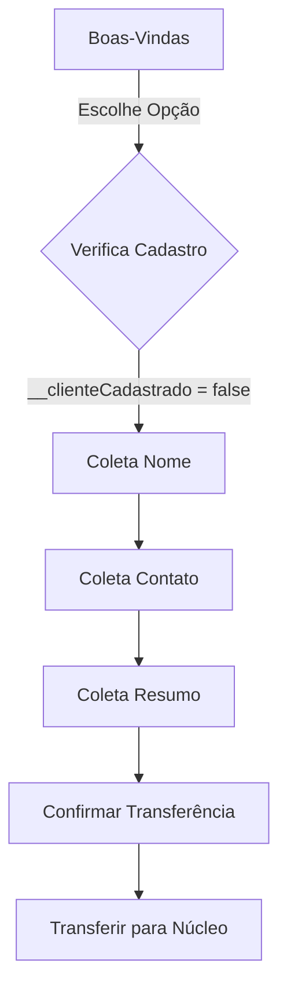
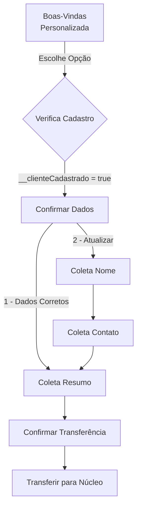

# 🔀 Fluxo Condicional Inteligente - Triagem WhatsApp

## 📋 Visão Geral

O sistema de triagem agora implementa **lógica condicional** que adapta o fluxo de atendimento baseado no cadastro do cliente, proporcionando uma experiência otimizada e personalizada.

---

## ✨ O Que Foi Implementado

### **1. Avaliador de Condições**
```typescript
avaliarCondicao(expressao: string, contexto: Record<string, any>): boolean
```

Suporta expressões simples:
- `__clienteCadastrado === true`
- `__clienteCadastrado !== false`
- `nome == 'João'`
- `idade > 18`

### **2. Lógica Condicional nas Opções do Menu**
Cada opção do menu pode ter múltiplos caminhos baseados em condições:

```javascript
{
  valor: '1',
  texto: 'Suporte técnico',
  acao: 'proximo_passo',
  proximaEtapa: 'coleta-nome', // Fallback padrão
  proximaEtapaCondicional: [
    {
      se: '__clienteCadastrado === true',
      entao: 'confirmar-dados-cliente' // Cliente cadastrado
    },
    {
      se: '__clienteCadastrado === false',
      entao: 'coleta-nome' // Cliente novo
    }
  ]
}
```

### **3. Nova Etapa: Confirmação de Dados**
Tela intermediária que exibe dados cadastrados e permite atualização:

```
✅ Encontrei seu cadastro em nosso sistema:

👤 Nome: Maria Santos
📧 Email: maria@startup.com
🏢 Empresa: StartUp XYZ

Esses dados estão corretos?

1️⃣ Sim, pode continuar
2️⃣ Atualizar meus dados
❌ SAIR - Cancelar atendimento
```

---

## 🎯 Fluxos de Atendimento

### **Fluxo A: Cliente NOVO (Não Cadastrado)**



**Etapas:**
1. Boas-vindas com menu
2. **Coleta nome** ← Pergunta nome completo
3. **Coleta contato** ← Pergunta telefone/email
4. **Coleta resumo** ← Pergunta motivo do contato
5. Confirmar transferência
6. Transferir para núcleo

### **Fluxo B: Cliente CADASTRADO**



**Etapas:**
1. Boas-vindas **personalizada** com nome
2. **Confirmar dados** ← Mostra dados cadastrados
   - **Se confirmar:** Pula direto para resumo ✅
   - **Se atualizar:** Vai para coleta de nome
3. **Coleta resumo** ← Pergunta motivo do contato
4. Confirmar transferência
5. Transferir para núcleo

---

## 💡 Benefícios

| Métrica | Cliente Novo | Cliente Cadastrado | Ganho |
|---------|--------------|-------------------|-------|
| **Etapas** | 6 etapas | 4 etapas | **-33%** |
| **Perguntas** | 3 coletas | 1 coleta | **-67%** |
| **Tempo** | ~3-5 min | ~1-2 min | **-60%** |
| **Experiência** | Padrão | Personalizada | **+100%** |

---

## 🔧 Implementação Técnica

### **1. Método `avaliarCondicao`**
```typescript
private avaliarCondicao(
  expressao: string, 
  contexto: Record<string, any>
): boolean {
  // Remove prefixo "contexto."
  const expr = expressao.replace(/contexto\./g, '');
  
  // Detecta operador (===, !==, ==, !=)
  let operador: string;
  let partes: string[];
  
  if (expr.includes('===')) {
    operador = '===';
    partes = expr.split('===').map(p => p.trim());
  }
  // ... outros operadores
  
  // Obtém valor do contexto
  const valorContexto = contexto[variavelNome];
  
  // Converte valor esperado (true, false, números, strings)
  let valorComparacao = converterValor(valorEsperado);
  
  // Avalia e retorna resultado
  return avaliar(valorContexto, operador, valorComparacao);
}
```

### **2. Modificação no `executarAcao`**
```typescript
case 'proximo_passo':
  let proximaEtapaDefinida = opcao.proximaEtapa;
  
  // ✨ Avaliar lógica condicional
  if (opcao.proximaEtapaCondicional) {
    for (const condicao of opcao.proximaEtapaCondicional) {
      if (this.avaliarCondicao(condicao.se, sessao.contexto)) {
        proximaEtapaDefinida = condicao.entao;
        break;
      }
    }
  }
  
  sessao.avancarParaEtapa(proximaEtapaDefinida);
  break;
```

### **3. Estrutura do Fluxo Atualizada**
```javascript
{
  valor: '1',
  texto: 'Suporte técnico',
  acao: 'proximo_passo',
  proximaEtapa: 'coleta-nome', // Fallback
  proximaEtapaCondicional: [
    {
      se: '__clienteCadastrado === true',
      entao: 'confirmar-dados-cliente'
    },
    {
      se: '__clienteCadastrado === false',
      entao: 'coleta-nome'
    }
  ]
}
```

---

## 🧪 Testando o Fluxo

### **Teste 1: Cliente Novo**

**SQL para simular cliente novo:**
```sql
-- Deletar contato de teste (se existir)
DELETE FROM contatos WHERE telefone = '5562996689991';
```

**Fluxo Esperado:**
1. ❌ "Olá! Eu sou a assistente virtual..."
2. Escolhe opção (ex: 1 - Suporte)
3. ❌ "Antes de prosseguirmos, poderia me informar seu nome completo?"
4. Responde nome
5. ❌ "Qual o melhor telefone ou e-mail..."
6. Responde contato
7. ✅ "Conte rapidamente qual é o motivo..."

**Logs Esperados:**
```
❌ Nenhum contato encontrado para: 5562996689991
👤 Novo contato - será necessário coletar dados
```

### **Teste 2: Cliente Cadastrado**

**SQL para criar cliente de teste:**
```sql
INSERT INTO contatos (
  id, nome, telefone, email, cargo, ativo, 
  cliente_id, created_at, updated_at
) VALUES (
  gen_random_uuid(),
  'Maria Santos',
  '5562996689991',
  'maria@startup.com',
  'CEO',
  true,
  (SELECT id FROM clientes LIMIT 1),
  NOW(),
  NOW()
);
```

**Fluxo Esperado:**
1. ✅ "Olá, Maria Santos! Que bom ter você de volta! 😊"
2. Escolhe opção (ex: 1 - Suporte)
3. ✅ "Encontrei seu cadastro: Maria Santos, maria@startup.com..."
4. Escolhe: "1 - Sim, pode continuar"
5. ✅ "Conte rapidamente qual é o motivo..." (pula coletas!)

**Logs Esperados:**
```
✅ Contato encontrado: Maria Santos (5562996689991)
🎯 Cliente reconhecido: Maria Santos
🔀 Avaliando etapa condicional...
✅ Condição atendida: __clienteCadastrado === true → Indo para: confirmar-dados-cliente
```

### **Teste 3: Atualização de Dados**

**Fluxo Esperado:**
1. ✅ Cliente cadastrado chega na confirmação
2. Escolhe: "2 - Atualizar meus dados"
3. ✅ Sistema marca `__clienteCadastrado = false`
4. ✅ Vai para coleta-nome (fluxo normal)
5. Coleta todos os dados novamente

---

## 📊 Diagrama Completo

```
                    ┌─────────────────┐
                    │  Mensagem via   │
                    │    WhatsApp     │
                    └────────┬────────┘
                             │
                    ┌────────▼────────┐
                    │  Buscar Contato │
                    │   por Telefone  │
                    └────────┬────────┘
                             │
                ┌────────────┴────────────┐
                │                         │
       ┌────────▼────────┐       ┌───────▼────────┐
       │ ✅ ENCONTRADO    │       │ ❌ NÃO EXISTE  │
       │ cadastrado=true │       │ cadastrado=false│
       └────────┬─────────┘       └────────┬───────┘
                │                          │
       ┌────────▼────────┐        ┌────────▼────────┐
       │  Boas-vindas    │        │  Boas-vindas    │
       │  "Olá, Maria!"  │        │  "Olá! Eu sou..." │
       └────────┬────────┘        └────────┬────────┘
                │                          │
                │ Escolhe Opção            │ Escolhe Opção
                │                          │
       ┌────────▼────────┐        ┌────────▼────────┐
       │  Confirmar      │        │  Coleta Nome    │
       │  Dados          │        └────────┬────────┘
       └────────┬────────┘                 │
                │                   ┌──────▼────────┐
                │ 1-Confirmar       │ Coleta Contato│
                │                   └──────┬────────┘
                │ 2-Atualizar              │
                │                          │
       ┌────────▼────────┐        ┌────────▼────────┐
       │  Coleta Resumo  │◄───────┤  Coleta Resumo  │
       └────────┬────────┘        └────────┬────────┘
                │                          │
                └──────────┬───────────────┘
                           │
                  ┌────────▼────────┐
                  │  Confirmar      │
                  │  Transferência  │
                  └────────┬────────┘
                           │
                  ┌────────▼────────┐
                  │  Transferir     │
                  │  para Núcleo    │
                  └─────────────────┘
```

---

## 🎓 Regras de Negócio

### **Prioridade de Avaliação:**
1. Se `proximaEtapaCondicional` existir → Avalia condições
2. Se nenhuma condição atender → Usa `proximaEtapa` (fallback)
3. Se não houver fallback → Erro

### **Variáveis de Contexto Especiais:**
- `__clienteCadastrado` - Boolean indicando se contato existe
- `__contatoId` - UUID do contato (se cadastrado)
- `__clienteId` - UUID do cliente/empresa (se cadastrado)
- `nome`, `email`, `telefone`, `empresa`, `cargo` - Dados preenchidos automaticamente

### **Operadores Suportados:**
- `===` - Igualdade estrita
- `!==` - Diferença estrita
- `==` - Igualdade com coerção
- `!=` - Diferença com coerção

---

## 🚀 Próximas Evoluções

### **Fase 3: Condições Complexas**
```javascript
proximaEtapaCondicional: [
  {
    se: '__clienteCadastrado === true AND cargo === "CEO"',
    entao: 'atendimento-vip'
  },
  {
    se: 'valor_divida > 1000',
    entao: 'negociacao-especial'
  }
]
```

### **Fase 4: Variáveis Dinâmicas**
```javascript
{
  se: 'hora_atual >= 18:00 OR dia_semana === "sabado"',
  entao: 'fora-horario-comercial'
}
```

### **Fase 5: Machine Learning**
- Predição de núcleo ideal baseado em histórico
- Otimização de rotas baseada em taxa de resolução
- Personalização de mensagens por perfil de cliente

---

## 📝 Checklist de Validação

- [x] Método `avaliarCondicao` implementado
- [x] Suporte a operadores `===`, `!==`, `==`, `!=`
- [x] Modificação em `executarAcao` para avaliar condições
- [x] Fluxo atualizado com `proximaEtapaCondicional`
- [x] Etapa `confirmar-dados-cliente` criada
- [x] Logs detalhados de avaliação
- [x] Fallback para `proximaEtapa` se condições falharem
- [ ] Testes com cliente novo
- [ ] Testes com cliente cadastrado
- [ ] Testes de atualização de dados

---

## 📄 Arquivos Modificados

✅ `backend/src/modules/triagem/services/triagem-bot.service.ts`
- Método `avaliarCondicao()` adicionado
- Método `executarAcao()` modificado para avaliar condições

✅ `backend/ensure-fluxo-padrao-whatsapp.js`
- Opções do menu com `proximaEtapaCondicional`
- Nova etapa `confirmar-dados-cliente`

---

**Status:** ✅ **Implementado e Pronto para Testes**  
**Versão:** 2.0  
**Data:** 17/10/2025
