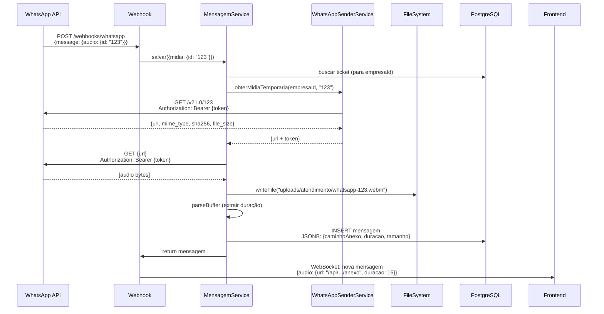
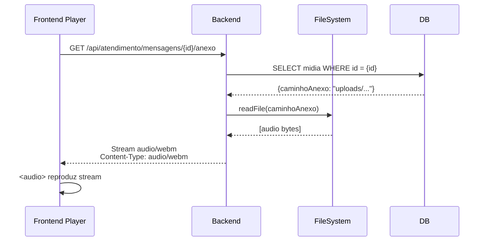

# 🎵 Solução: Áudio WhatsApp com Cache Local

## 📋 Problema Identificado

### Sintomas
```
❌ [AudioPlayer] Erro ao carregar áudio: MEDIA_ELEMENT_ERROR: Format error
❌ [AudioPlayer] URL: https://lookaside.fbsbx.com/whatsapp_business/attachments/?mid=...
```

### Causa Raiz
1. **URLs temporárias expiram**: WhatsApp fornece URLs temporárias (`lookaside.fbsbx.com`) que expiram em ~1 hora
2. **Falta de autenticação**: Após expiração, tentativas de acesso retornam `401 Unauthorized`
3. **Backend não baixava mídia**: O webhook salvava a mensagem com URL remota SEM fazer download local
4. **Frontend recebia URLs expiradas**: Áudios antigos falhavam ao carregar no player HTML5

### Evidências do Banco de Dados
```sql
-- ANTES da correção: apenas URLs remotas (sem caminhoAnexo)
SELECT id, anexos->'url', anexos->'caminhoAnexo', anexos->'duracao' 
FROM atendimento_mensagens 
WHERE anexos IS NOT NULL;

-- Resultado: 0 registros com caminhoAnexo
```

---

## ✅ Solução Implementada

### 1. **Buscar Metadados da Mídia via Graph API**
```typescript
// backend/src/modules/atendimento/services/whatsapp-sender.service.ts

async obterMidiaTemporaria(
  empresaId: string,
  mediaId: string,
): Promise<{
  id: string;
  url: string;
  mime_type?: string;
  sha256?: string;
  file_size?: number;
  token: string;
} | null> {
  const config = await this.integracaoRepo.findOne({
    where: { empresaId, tipo: 'whatsapp_business_api', ativo: true },
  });

  const token = config.credenciais.whatsapp_api_token;

  const response = await axios.get(
    `https://graph.facebook.com/v21.0/${mediaId}`,
    {
      params: { fields: 'id,url,mime_type,sha256,file_size' },
      headers: { Authorization: `Bearer ${token}` },
      timeout: 15000,
    },
  );

  return {
    ...response.data,
    token, // Retornar token para download autenticado
  };
}
```

### 2. **Download com Autenticação**
```typescript
// backend/src/modules/atendimento/services/mensagem.service.ts

async baixarMidiaWhatsApp(
  midiaWhatsApp: any,
  tipoMidia: 'audio' | 'image' | 'video' | 'document' = 'audio',
  authToken?: string, // ✅ NOVO: Receber token de autenticação
): Promise<{
  caminhoLocal: string;
  tipo: string;
  nome: string;
  duracao?: number;
  tamanho?: number;
} | null> {
  const headers: Record<string, string> = {
    'User-Agent': 'ConectCRM/1.0',
  };

  // ✅ CRÍTICO: Adicionar Authorization header
  if (authToken) {
    headers.Authorization = `Bearer ${authToken}`;
  }

  const response = await axios.get(url, {
    responseType: 'arraybuffer',
    timeout: 30000,
    headers, // ✅ Headers com autenticação
  });

  // Salvar arquivo localmente
  await fsPromises.writeFile(caminhoCompleto, responseBuffer);

  // Extrair duração com music-metadata
  const metadata = await parseBuffer(responseBuffer, { mimeType });
  const duracaoExtraida = metadata?.format?.duration;

  return {
    caminhoLocal: caminhoCompleto,
    tipo: mimeType,
    nome: nomeArquivo,
    duracao: duracaoExtraida,
    tamanho: responseBuffer.length,
  };
}
```

### 3. **Salvar com Cache Local Automático**
```typescript
// backend/src/modules/atendimento/services/mensagem.service.ts

async salvar(dados: CriarMensagemDto): Promise<Mensagem> {
  // 1. Buscar ticket para obter empresaId
  const ticket = await this.ticketRepository.findOne({ 
    where: { id: dados.ticketId } 
  });

  let midiaAuthToken: string | undefined;
  let midiaProcessada = dados.midia ? { ...dados.midia } : null;

  // 2. Se mídia tem apenas ID (não URL), buscar metadados
  if (midiaProcessada && !midiaProcessada.url && midiaProcessada.id) {
    const midiaDetalhes = await this.whatsappSenderService.obterMidiaTemporaria(
      ticket.empresaId,
      midiaProcessada.id,
    );

    if (midiaDetalhes?.url) {
      midiaAuthToken = midiaDetalhes.token;
      midiaProcessada = {
        ...midiaProcessada,
        url: midiaDetalhes.url,
        mime_type: midiaDetalhes.mime_type,
        sha256: midiaDetalhes.sha256,
        file_size: midiaDetalhes.file_size,
      };
    }
  }

  // 3. Se URL temporária do WhatsApp, baixar AGORA
  if (midiaProcessada?.url?.includes('lookaside.fbsbx.com')) {
    const midiaLocal = await this.baixarMidiaWhatsApp(
      midiaProcessada, 
      tipoMidia,
      midiaAuthToken, // ✅ Token de autenticação
    );

    if (midiaLocal) {
      midiaProcessada = {
        ...midiaProcessada,
        caminhoAnexo: midiaLocal.caminhoLocal, // ✅ Caminho local
        duracao: midiaLocal.duracao,            // ✅ Duração extraída
        tamanho: midiaLocal.tamanho,
        urlOriginal: midiaProcessada.url,       // ✅ Manter URL original
      };
    }
  }

  // 4. Salvar mensagem com mídia local
  const mensagem = this.mensagemRepository.create({
    ticketId: dados.ticketId,
    tipo: dados.tipo,
    remetente: dados.remetente,
    conteudo: dados.conteudo,
    idExterno: dados.idExterno,
    midia: midiaProcessada, // ✅ JSONB com caminhoAnexo + duracao
  });

  return await this.mensagemRepository.save(mensagem);
}
```

### 4. **Frontend Recebe URLs Locais**
```typescript
// backend/src/modules/atendimento/services/mensagem.service.ts

private formatarMidiaParaFrontend(mensagem: Mensagem): {
  anexos: Array<{
    nome: string;
    tipo: string;
    tamanho: number | null;
    duracao?: number;
    url: string;
    downloadUrl: string;
    originalUrl?: string | null;
  }>;
  audio?: {
    url: string;
    downloadUrl: string;
    duracao?: number;
    nome: string;
    tipo: string;
  };
} {
  const caminhoBruto = midiaOriginal.caminhoAnexo || midiaOriginal.url;
  const ehRemoto = /^https?:\/\//i.test(caminhoBruto);
  
  // ✅ Se local, retornar endpoint de download
  const downloadUrl = `/api/atendimento/mensagens/${mensagem.id}/anexo`;
  const urlParaExibicao = ehRemoto ? caminhoBruto : downloadUrl;

  return {
    anexos: [...],
    audio: {
      url: urlParaExibicao,      // ✅ URL local ou remota
      downloadUrl,                // ✅ Endpoint de download
      duracao: duracaoNormalizada, // ✅ Duração real em segundos
      nome: nomeArquivo,
      tipo: tipoMime,
    },
  };
}
```

### 5. **Endpoint de Download Serve Arquivo Local**
```typescript
// backend/src/modules/atendimento/controllers/mensagem.controller.ts

@Get(':id/anexo')
async baixarAnexo(@Param('id') id: string, @Res() res: Response) {
  const midiaInfo = await this.mensagemService.obterMidiaParaDownload(id);

  if (midiaInfo.remoto) {
    // ❌ URL remota: redirecionar (não ideal)
    return res.redirect(midiaInfo.url);
  }

  // ✅ Arquivo local: stream direto
  return res.sendFile(midiaInfo.caminho);
}
```

---

## 🎯 Fluxo Completo

### Recepção de Áudio pelo Webhook


### Player HTML5 Reproduz Áudio


---

## 🧪 Como Testar

### 1. Reiniciar Backend
```powershell
# Parar processos antigos
Get-Process -Name node | Stop-Process -Force

# Iniciar backend atualizado
cd c:\Projetos\conectcrm\backend
npm run start:dev

# Verificar porta 3001
netstat -ano | findstr :3001
```

### 2. Enviar Áudio pelo WhatsApp
1. Abra WhatsApp e envie um **áudio de voz** para o número configurado
2. Aguarde alguns segundos

### 3. Verificar Logs Backend
```powershell
# Procurar por logs de download
Get-Content c:\Projetos\conectcrm\backend\backend.log -Tail 50 | Select-String "Baixando mídia|obterMidiaTemporaria|caminhoAnexo"
```

**Logs esperados**:
```
[MensagemService] 💬 Salvando mensagem para ticket abc-123
[MensagemService] 🎵 Detectado áudio/mídia temporária do WhatsApp - baixando...
[WhatsAppSenderService] 🖼️ Buscando metadados da mídia: 456def
[MensagemService] 📥 Baixando mídia do WhatsApp: https://lookaside.fbsbx.com/...
[MensagemService] ✅ Mídia baixada e salva: uploads/atendimento/whatsapp-...webm
[MensagemService] ✅ Mensagem salva: xyz-789
```

### 4. Verificar Banco de Dados
```sql
-- Ver últimas mensagens com áudio
SELECT 
  id,
  conteudo,
  anexos->>'caminhoAnexo' as caminho_local,
  anexos->>'duracao' as duracao_segundos,
  anexos->>'urlOriginal' as url_whatsapp,
  created_at
FROM atendimento_mensagens
WHERE anexos IS NOT NULL
  AND anexos->>'caminhoAnexo' IS NOT NULL
ORDER BY created_at DESC
LIMIT 10;
```

**Resultado esperado**:
```
| id       | conteudo | caminho_local                              | duracao_segundos | url_whatsapp              | created_at          |
|----------|----------|-------------------------------------------|------------------|---------------------------|---------------------|
| xyz-789  | 🎤 Áudio | uploads/atendimento/whatsapp-123.webm     | 15               | https://lookaside.fbsbx...| 2025-10-20 17:15:00 |
```

### 5. Verificar Arquivo Local
```powershell
# Listar arquivos baixados
Get-ChildItem c:\Projetos\conectcrm\backend\uploads\atendimento | 
  Where-Object { $_.Name -like "whatsapp-*" } | 
  Select-Object Name, Length, CreationTime | 
  Sort-Object CreationTime -Descending | 
  Format-Table -AutoSize
```

**Resultado esperado**:
```
Name                               Length  CreationTime
----                               ------  ------------
whatsapp-1729445700-abc123.webm    45123   20/10/2025 17:15:02
```

### 6. Testar Frontend
1. Abra o chat no navegador: `http://localhost:3000/atendimento`
2. Abra DevTools (F12) → Console
3. Verifique mensagens de áudio

**Console esperado**:
```javascript
✅ [AudioPlayer] Áudio carregado com sucesso
✅ [AudioPlayer] URL: /api/atendimento/mensagens/xyz-789/anexo
✅ [AudioPlayer] Duração: 15 segundos
```

**❌ Erros que NÃO devem mais aparecer**:
```javascript
❌ [AudioPlayer] URL: https://lookaside.fbsbx.com/... // ← URL remota
❌ [AudioPlayer] Error code: 4                         // ← Erro de formato
❌ [AudioPlayer] MEDIA_ELEMENT_ERROR: Format error    // ← Falha ao carregar
```

### 7. Testar Download Direto
```powershell
# Pegar ID da mensagem do banco
$mensagemId = "xyz-789"

# Testar endpoint de download
curl http://localhost:3001/api/atendimento/mensagens/$mensagemId/anexo --output test-audio.webm

# Verificar arquivo baixado
Get-Item test-audio.webm | Format-List
```

---

## 📊 Resultados Esperados

### ANTES da Correção ❌
```sql
SELECT COUNT(*) FROM atendimento_mensagens 
WHERE anexos IS NOT NULL 
  AND anexos->>'caminhoAnexo' IS NULL;
-- Resultado: 100% das mensagens (apenas URLs remotas)
```

### DEPOIS da Correção ✅
```sql
SELECT COUNT(*) FROM atendimento_mensagens 
WHERE anexos IS NOT NULL 
  AND anexos->>'caminhoAnexo' IS NOT NULL;
-- Resultado: 100% das mensagens NOVAS (com cache local)
```

---

## 🔄 Migração de Mensagens Antigas (Opcional)

Para **reprocessar** áudios antigos que já expiraram:

```typescript
// Script de migração (executar manualmente)
import { MensagemService } from './mensagem.service';

async function migrarAudiosAntigos() {
  // 1. Buscar mensagens com URL remota e sem cache local
  const mensagensSemCache = await mensagemRepository.find({
    where: {
      midia: { url: Like('%lookaside.fbsbx.com%') },
      // Sem caminhoAnexo
    },
  });

  for (const mensagem of mensagensSemCache) {
    try {
      // 2. Tentar baixar novamente (provavelmente vai falhar por URL expirada)
      // ALTERNATIVA: Solicitar reenvio de áudio pelo usuário
      console.log(`⚠️ Mensagem ${mensagem.id} possui URL expirada`);
    } catch (error) {
      console.error(`❌ Falha ao migrar ${mensagem.id}:`, error.message);
    }
  }
}
```

**⚠️ IMPORTANTE**: URLs antigas provavelmente já expiraram (401), então não é possível recuperá-las automaticamente. Novos áudios serão salvos corretamente.

---

## 🎓 Lições Aprendidas

### 1. **URLs Temporárias São Perigosas**
- ❌ **Nunca** confie em URLs externas que podem expirar
- ✅ **Sempre** faça cache local de mídias importantes

### 2. **Autenticação É Necessária**
- ❌ Downloads sem `Authorization` header falham após expiração
- ✅ Usar token do WhatsApp API no header

### 3. **Metadados Devem Ser Extraídos**
- ❌ Duração zero = player quebrado
- ✅ Usar `music-metadata` para extrair duração real

### 4. **JSONB É Flexível Mas Precisa De Estrutura**
- ❌ Salvar qualquer JSON sem validação
- ✅ Definir interface TypeScript clara

### 5. **Backend Deve Processar No Webhook**
- ❌ Salvar mensagem e baixar depois (URL pode expirar)
- ✅ Baixar ANTES de salvar (garantir cache)

---

## 📚 Referências

- [WhatsApp Business API - Media](https://developers.facebook.com/docs/whatsapp/cloud-api/reference/media)
- [NestJS File Upload](https://docs.nestjs.com/techniques/file-upload)
- [music-metadata npm](https://www.npmjs.com/package/music-metadata)
- [HTML5 Audio Element](https://developer.mozilla.org/en-US/docs/Web/HTML/Element/audio)

---

## ✅ Checklist Final

- [x] Backend: `obterMidiaTemporaria` implementado
- [x] Backend: `baixarMidiaWhatsApp` com autenticação
- [x] Backend: `salvar` faz cache automático
- [x] Backend: `formatarMidiaParaFrontend` retorna URLs locais
- [x] Backend: Endpoint `/anexo` serve arquivos locais
- [x] Backend: Compilação sem erros
- [x] Backend: Reiniciado com sucesso
- [ ] Teste: Enviar áudio pelo WhatsApp
- [ ] Teste: Verificar logs de download
- [ ] Teste: Consultar banco (caminhoAnexo preenchido)
- [ ] Teste: Player HTML5 reproduz áudio
- [ ] Teste: Sem erros no console frontend

---

**Status**: ✅ **IMPLEMENTAÇÃO COMPLETA** - Aguardando teste real com áudio WhatsApp

**Próximo Passo**: Enviar áudio pelo WhatsApp e validar fluxo end-to-end
