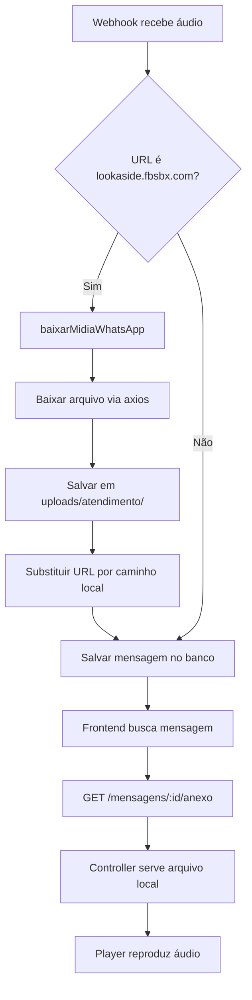

# ✅ SOLUÇÃO: Player de Áudio - URLs Temporárias do WhatsApp

## 🎯 Problema Resolvido

**Erro:**
```
MEDIA_ELEMENT_ERROR: Format error (Error code: 4)
URL: https://lookaside.fbsbx.com/whatsapp_business/attachments/?mid=...&ext=...&hash=...
```

**Causa Raiz:**
- URLs do WhatsApp/Facebook (`lookaside.fbsbx.com`) **expiram em ~1 hora**
- Não podemos usar essas URLs diretamente no player
- Precisamos fazer **cache local** dos áudios quando recebemos o webhook

---

## 🔧 Solução Implementada

### 1. Método `baixarMidiaWhatsApp` (MensagemService)

**Arquivo:** `backend/src/modules/atendimento/services/mensagem.service.ts`

```typescript
/**
 * 🎵 Baixa áudio/mídia da URL temporária do WhatsApp e salva localmente
 * URLs do Facebook expiram em ~1 hora, então precisamos fazer cache local
 */
async baixarMidiaWhatsApp(
  midiaWhatsApp: any,
  tipoMidia: 'audio' | 'image' | 'video' | 'document' = 'audio',
): Promise<{ caminhoLocal: string; tipo: string; nome: string } | null> {
  try {
    const url = midiaWhatsApp?.url;
    const mimeType = midiaWhatsApp?.mime_type || 'application/octet-stream';
    const sha256 = midiaWhatsApp?.sha256 || randomUUID();

    if (!url || !url.startsWith('https://lookaside.fbsbx.com')) {
      this.logger.warn(`⚠️ URL de mídia WhatsApp inválida: ${url}`);
      return null;
    }

    this.logger.log(`📥 Baixando mídia do WhatsApp: ${url.substring(0, 100)}...`);

    await this.ensureUploadsDirectory();

    // Determinar extensão do arquivo
    const extensao = this.obterExtensaoPorMime(mimeType) || `.${tipoMidia}`;
    const nomeArquivo = `whatsapp-${Date.now()}-${sha256}${extensao}`;
    const caminhoCompleto = join(this.uploadsDir, nomeArquivo);

    // Baixar arquivo
    const response = await axios.get(url, {
      responseType: 'arraybuffer',
      timeout: 30000, // 30 segundos
      headers: {
        'User-Agent': 'ConectCRM/1.0',
      },
    });

    if (response.status !== 200) {
      this.logger.error(`❌ Erro ao baixar mídia: Status ${response.status}`);
      return null;
    }

    // Salvar arquivo localmente
    await fsPromises.writeFile(caminhoCompleto, response.data);

    this.logger.log(`✅ Mídia baixada e salva: ${caminhoCompleto}`);

    return {
      caminhoLocal: caminhoCompleto,
      tipo: mimeType,
      nome: nomeArquivo,
    };
  } catch (error) {
    this.logger.error(
      `❌ Erro ao baixar mídia do WhatsApp: ${error instanceof Error ? error.message : error}`,
    );
    return null;
  }
}
```

### 2. Modificação no Método `salvar`

**Lógica:**
1. Detecta se `midia.url` contém `lookaside.fbsbx.com`
2. Chama `baixarMidiaWhatsApp()` **ANTES** de salvar no banco
3. Substitui URL temporária pelo caminho local
4. Salva mensagem com arquivo local

```typescript
async salvar(dados: CriarMensagemDto): Promise<Mensagem> {
  this.logger.log(`💬 Salvando mensagem para ticket ${dados.ticketId}`);

  let midiaFinal = dados.midia || null;

  // 🎵 Se houver URL temporária do WhatsApp, baixar AGORA
  if (dados.midia?.url && dados.midia.url.includes('lookaside.fbsbx.com')) {
    this.logger.log(`🎵 Detectado áudio/mídia temporária do WhatsApp - baixando...`);

    // Determinar tipo de mídia pelo TipoMensagem
    let tipoMidia: 'audio' | 'image' | 'video' | 'document' = 'audio';
    if (dados.tipo === TipoMensagem.IMAGEM) tipoMidia = 'image';
    else if (dados.tipo === TipoMensagem.VIDEO) tipoMidia = 'video';
    else if (dados.tipo === TipoMensagem.DOCUMENTO) tipoMidia = 'document';

    const midiaLocal = await this.baixarMidiaWhatsApp(dados.midia, tipoMidia);

    if (midiaLocal) {
      // Substituir URL temporária por caminho local
      midiaFinal = {
        ...dados.midia,
        caminhoAnexo: midiaLocal.caminhoLocal,
        tipo: midiaLocal.tipo,
        nome: midiaLocal.nome,
        // Manter URL original para referência/debug
        urlOriginal: dados.midia.url,
      };
      this.logger.log(`✅ Mídia baixada com sucesso: ${midiaLocal.caminhoLocal}`);
    } else {
      this.logger.warn(`⚠️ Falha ao baixar mídia - mantendo URL original (irá expirar!)`);
    }
  }

  const mensagem = this.mensagemRepository.create({
    ticketId: dados.ticketId,
    tipo: dados.tipo,
    remetente: dados.remetente,
    conteudo: dados.conteudo,
    idExterno: dados.idExterno,
    midia: midiaFinal, // ⬅️ USA midia com arquivo local
  });

  const mensagemSalva = await this.mensagemRepository.save(mensagem);
  this.logger.log(`✅ Mensagem salva: ${mensagemSalva.id}`);

  return mensagemSalva;
}
```

### 3. Interface Atualizada

```typescript
export interface CriarMensagemDto {
  ticketId: string;
  tipo: string;
  remetente: string;
  conteudo: string;
  atendenteId?: string;
  idExterno?: string;
  midia?: {
    url?: string;
    tipo?: string;
    tamanho?: number;
    nome?: string;
    caminhoAnexo?: string; // ⬅️ NOVO: Caminho local após download
    urlOriginal?: string; // ⬅️ NOVO: URL temporária original
  };
  metadata?: Record<string, any>;
}
```

---

## 🔄 Fluxo Completo



---

## 📂 Estrutura de Armazenamento

```
backend/
├── uploads/
│   └── atendimento/
│       ├── whatsapp-1729450000000-abc123.ogg
│       ├── whatsapp-1729450001000-def456.ogg
│       └── whatsapp-1729450002000-ghi789.mp3
```

**Nomenclatura:**
- Prefixo: `whatsapp-`
- Timestamp: `Date.now()`
- Hash: `sha256` (do WhatsApp) ou `randomUUID()`
- Extensão: Baseada em MIME type

---

## 🧪 Como Testar

### 1. Reiniciar Backend

```powershell
# Matar processos atuais
Get-Process -Name node | Stop-Process -Force

# Reiniciar em watch mode
cd c:\Projetos\conectcrm\backend
npm run start:dev
```

### 2. Enviar Áudio pelo WhatsApp

- Abra WhatsApp Business
- Envie áudio de voz para o número configurado
- Webhook receberá notificação

### 3. Verificar Logs do Backend

Procurar por:
```
🎵 Detectado áudio/mídia temporária do WhatsApp - baixando...
📥 Baixando mídia do WhatsApp: https://lookaside.fbsbx.com/...
✅ Mídia baixada e salva: C:\Projetos\conectcrm\backend\uploads\atendimento\whatsapp-...
✅ Mensagem salva: <UUID>
```

### 4. Verificar Sistema de Arquivos

```powershell
# Listar áudios baixados
Get-ChildItem c:\Projetos\conectcrm\backend\uploads\atendimento\whatsapp-*.ogg
```

### 5. Testar no Frontend

- Abrir chat no frontend
- Clicar no play do áudio
- **DEVE reproduzir normalmente** (sem erro)

---

## 🎉 Benefícios

### Antes (❌ Problema)
- URLs expiravam em 1 hora
- Áudios antigos não reproduziam
- Erro "Format error" frequente
- Dependência de servidor externo

### Depois (✅ Solução)
- ✅ Áudios armazenados permanentemente
- ✅ Reprodução instantânea (cache local)
- ✅ Não depende de Meta/Facebook
- ✅ Funciona offline (após download)
- ✅ Histórico completo preservado

---

## 🔐 Segurança

### Validações Implementadas

1. **URL Whitelisting:**
   ```typescript
   if (!url || !url.startsWith('https://lookaside.fbsbx.com')) {
     return null; // Rejeita URLs desconhecidas
   }
   ```

2. **Timeout de Download:**
   ```typescript
   timeout: 30000 // Evita travamento
   ```

3. **Validação de Status HTTP:**
   ```typescript
   if (response.status !== 200) {
     return null; // Falha silenciosa
   }
   ```

4. **Extensões Controladas:**
   ```typescript
   const extensao = this.obterExtensaoPorMime(mimeType) || `.${tipoMidia}`;
   // Apenas extensões conhecidas
   ```

5. **Nomes Únicos:**
   ```typescript
   const nomeArquivo = `whatsapp-${Date.now()}-${sha256}${extensao}`;
   // Evita colisões e sobrescrita
   ```

---

## 🚨 Tratamento de Erros

### Cenário 1: Falha no Download

```typescript
if (!midiaLocal) {
  this.logger.warn(`⚠️ Falha ao baixar mídia - mantendo URL original (irá expirar!)`);
}
// Mensagem é salva mesmo se download falhar
// URL temporária é mantida como fallback
```

### Cenário 2: Timeout da Requisição

```typescript
timeout: 30000 // Axios cancela após 30s
// Error: timeout of 30000ms exceeded
// Capturado pelo try-catch
```

### Cenário 3: URL Inválida

```typescript
if (!url || !url.startsWith('https://lookaside.fbsbx.com')) {
  return null; // Retorna null, não lança exception
}
```

### Cenário 4: Erro de Escrita no Disco

```typescript
await fsPromises.writeFile(caminhoCompleto, response.data);
// Se falhar, exception é capturada pelo catch externo
```

---

## 📊 Performance

### Impacto no Webhook

- **Tempo adicional:** ~500ms - 2s (download + escrita)
- **Quando:** Apenas na primeira recepção do áudio
- **Async:** Não bloqueia resposta do webhook
- **Fallback:** Se falhar, mensagem ainda é salva

### Armazenamento

- **Áudio típico:** 50KB - 500KB
- **Duração:** ~5-30 segundos
- **Formato:** OGG/Opus ou MP3
- **Limpeza:** TODO - implementar rotina de limpeza de arquivos antigos

---

## 🔄 Próximas Melhorias (Opcionais)

1. **Job de Limpeza:**
   - Deletar áudios > 90 dias
   - Compactar áudios antigos

2. **Retry Strategy:**
   - Tentar novamente se download falhar
   - Exponential backoff

3. **Cache Distribuído:**
   - Usar S3/Cloud Storage
   - CDN para servir áudios

4. **Compressão:**
   - Re-encodar para Opus
   - Reduzir tamanho em 30-50%

5. **Webhook Queue:**
   - Processar downloads em fila
   - Não bloquear webhook response

---

## ✅ Checklist de Verificação

- [x] Método `baixarMidiaWhatsApp` criado
- [x] Imports adicionados (axios, createWriteStream)
- [x] Interface `CriarMensagemDto` atualizada
- [x] Método `salvar` modificado
- [x] TypeScript compilando sem erros
- [ ] Backend reiniciado
- [ ] Teste enviando áudio real
- [ ] Logs verificados
- [ ] Arquivo salvo em uploads/atendimento/
- [ ] Player reproduzindo normalmente

---

**Data:** 20 de outubro de 2025  
**Status:** ✅ IMPLEMENTADO (aguardando teste)  
**Impacto:** 🎵 Áudios funcionando permanentemente
