# 📄 Guia de Templates - ConectCRM

## 🎯 Qual Template Usar?

O ConectCRM possui **DOIS templates** para criação de páginas:

---

## 1️⃣ Template SIMPLES (sem KPIs)

### 📂 Arquivo
`frontend-web/src/pages/_TemplateSimplePage.tsx`

### ✅ Use Quando:
- Cadastros básicos (ex: categorias, tags, departamentos)
- Páginas de configuração
- Listagens simples sem métricas
- Formulários de edição
- Páginas auxiliares/secundárias
- Telas CRUD puras

### 🎨 Estrutura:
```
1. Header com BackToNucleus
2. Título da página + botão novo
3. Barra de busca/filtros
4. Grid de cards (sem KPIs)
5. Modal de criação/edição
```

### 📊 Exemplo de Uso:
```bash
# Copiar template
cp frontend-web/src/pages/_TemplateSimplePage.tsx \
   frontend-web/src/pages/CategoriasProdutosPage.tsx

# Substituir marcadores [PERSONALIZAR]
# Ajustar cores e textos
# Conectar com service
```

### 💡 Exemplos Ideais:
- Gestão de Categorias
- Cadastro de Tags
- Configurações de Sistema
- Tipos de Documento
- Status Personalizados
- Departamentos
- Grupos de Acesso

---

## 2️⃣ Template COMPLETO (com KPIs)

### 📂 Arquivo
`frontend-web/src/pages/_TemplateWithKPIsPage.tsx`

### ✅ Use Quando:
- Dashboards com métricas
- Páginas principais de módulos
- Telas que mostram estatísticas
- Páginas de overview/resumo
- Gestão com indicadores importantes
- Telas que exigem visão analítica

### 🎨 Estrutura:
```
1. Header com BackToNucleus
2. Título da página + botão novo
3. 🆕 4 Cards de KPIs (métricas)
4. Barra de busca/filtros
5. Grid de cards
6. Modal de criação/edição
```

### 📊 Exemplo de Uso:
```bash
# Copiar template
cp frontend-web/src/pages/_TemplateWithKPIsPage.tsx \
   frontend-web/src/pages/GestaoClientesPage.tsx

# Substituir marcadores [PERSONALIZAR]
# Definir métricas nos KPI cards
# Ajustar cores e textos
# Conectar com service
```

### 💡 Exemplos Ideais:
- Gestão de Clientes (total, ativos, inativos, novos)
- Gestão de Equipes (total, membros, atribuições)
- Produtos (total, estoque, vendidos, baixo estoque)
- Cotações (total, pendentes, aprovadas, valor total)
- Faturas (total, pagas, vencidas, valor total)
- Contratos (ativos, vencendo, renovados)
- Atendimentos (abertos, em andamento, resolvidos)

---

## 🎨 KPI Cards - Quando e Como Usar

### 4 Cards de Métricas

```tsx
// Card 1 - Total/Geral (Blue)
<div className="bg-gradient-to-br from-blue-100 to-blue-200">
  <p>Total de Clientes</p>
  <p className="text-3xl">{totalClientes}</p>
</div>

// Card 2 - Ativo/Sucesso (Green)
<div className="bg-gradient-to-br from-green-100 to-green-200">
  <p>Clientes Ativos</p>
  <p className="text-3xl">{clientesAtivos}</p>
</div>

// Card 3 - Inativo/Neutro (Gray)
<div className="bg-gradient-to-br from-gray-100 to-gray-200">
  <p>Clientes Inativos</p>
  <p className="text-3xl">{clientesInativos}</p>
</div>

// Card 4 - Personalizado (Purple/Yellow/Red)
<div className="bg-gradient-to-br from-purple-100 to-purple-200">
  <p>Novos Este Mês</p>
  <p className="text-3xl">{clientesNovos}</p>
</div>
```

### ❌ NÃO Use KPIs Quando:
- Dados não têm métricas relevantes
- Página é só CRUD básico
- Não há estatísticas a mostrar
- Foco é configuração/cadastro simples

### ✅ Use KPIs Quando:
- Há métricas importantes (total, ativos, etc)
- Dashboard precisa de overview
- Usuário precisa ver estatísticas rápidas
- Página é ponto central de gestão

---

## 📋 Comparação Side-by-Side

| Feature | Template SIMPLES | Template COM KPIs |
|---------|------------------|-------------------|
| **BackToNucleus** | ✅ Sim | ✅ Sim |
| **Título + Descrição** | ✅ Sim | ✅ Sim |
| **Botão Refresh** | ✅ Sim | ✅ Sim |
| **Botão Novo** | ✅ Sim | ✅ Sim |
| **KPI Cards (4)** | ❌ Não | ✅ Sim |
| **Barra de Busca** | ✅ Sim | ✅ Sim |
| **Grid de Cards** | ✅ Sim | ✅ Sim |
| **Estado Vazio** | ✅ Sim | ✅ Sim |
| **Loading State** | ✅ Sim | ✅ Sim |
| **Error Handling** | ✅ Sim | ✅ Sim |
| **Modal CRUD** | ✅ Sim | ✅ Sim |
| **Cores Crevasse** | ✅ Sim | ✅ Sim |
| **Responsivo** | ✅ Sim | ✅ Sim |
| **Linhas de Código** | ~420 | ~512 |

---

## 🚀 Fluxo de Decisão

```mermaid
graph TD
    A[Criar Nova Página] --> B{Precisa mostrar<br/>métricas/KPIs?}
    B -->|Sim| C[Template COM KPIs<br/>_TemplateWithKPIsPage.tsx]
    B -->|Não| D[Template SIMPLES<br/>_TemplateSimplePage.tsx]
    C --> E[4 KPI Cards<br/>Total, Ativos, Inativos, Custom]
    D --> F[Direto para Busca/Grid]
    E --> G[Barra de Busca]
    F --> G
    G --> H[Grid de Cards]
    H --> I[Modal CRUD]
```



---

## 📝 Checklist de Decisão

### Faça estas perguntas:

1. **A página mostra estatísticas importantes?**
   - ✅ Sim → Template COM KPIs
   - ❌ Não → Template SIMPLES

2. **Os usuários precisam ver métricas ao abrir a página?**
   - ✅ Sim → Template COM KPIs
   - ❌ Não → Template SIMPLES

3. **É uma página principal de um módulo?**
   - ✅ Sim → Template COM KPIs (provavelmente)
   - ❌ Não → Template SIMPLES (provavelmente)

4. **Há pelo menos 3-4 métricas relevantes?**
   - ✅ Sim → Template COM KPIs
   - ❌ Não → Template SIMPLES

5. **É um cadastro auxiliar/secundário?**
   - ✅ Sim → Template SIMPLES
   - ❌ Não → Avaliar métricas

---

## 🎯 Exemplos Práticos

### ✅ Template SIMPLES

```typescript
// ✅ BOM - Cadastro simples
CategoriasProdutosPage.tsx
DepartamentosPage.tsx
TagsPage.tsx
ConfiguracoesPage.tsx
TiposDocumentoPage.tsx
StatusPersonalizadosPage.tsx
GruposAcessoPage.tsx
```

### ✅ Template COM KPIs

```typescript
// ✅ BOM - Gestão com métricas
GestaoClientesPage.tsx       // Total, Ativos, Inativos, Novos
GestaoEquipesPage.tsx         // Total, Membros, Atribuições, Disponíveis
ProdutosPage.tsx              // Total, Estoque, Vendidos, Alerta
CotacoesPage.tsx              // Total, Pendentes, Aprovadas, Valor
FaturasPage.tsx               // Total, Pagas, Vencidas, Valor
AtendimentosPage.tsx          // Abertos, Em Andamento, Resolvidos, SLA
```

---

## 🔄 Migração Entre Templates

### De SIMPLES para COM KPIs

Se você criou uma página com template simples e depois percebeu que precisa de KPIs:

```bash
# 1. Abrir _TemplateWithKPIsPage.tsx
# 2. Copiar seção "Dashboard Cards" (linhas 220-304)
# 3. Colar na sua página ANTES da "Barra de Busca"
# 4. Ajustar cálculos de métricas
# 5. Personalizar cores dos gradientes
```

### De COM KPIs para SIMPLES

Se você usou template com KPIs mas não precisa deles:

```bash
# 1. Deletar seção "Dashboard Cards" (linhas 220-304)
# 2. Remover cálculos de métricas (totalItems, itensAtivos, etc)
# 3. Simplificar descrição do header
# 4. Pronto!
```

---

## 📚 Referências

### Documentação Relacionada
- **COMPONENTS_GUIDE.md** - Componentes prontos (sem contexto de página)
- **DESIGN_GUIDELINES.md** - Guidelines gerais de design
- **.github/copilot-instructions.md** - Regras do Copilot (seção Templates)

### Arquivos de Template
- `_TemplateSimplePage.tsx` - Sem KPIs (420 linhas)
- `_TemplateWithKPIsPage.tsx` - Com KPIs (512 linhas)

### Cores Crevasse (usar sempre)
- Primary: `#159A9C` (Crevasse-2 teal)
- Text: `#002333` (Crevasse-3 dark)
- Secondary: `#B4BEC9` (Crevasse-1 gray)
- Border: `#B4BEC9` / `#DEEFE7`
- Background: `#FFFFFF` / `#DEEFE7`

---

## 💡 Dicas Profissionais

### Dica 1: Comece Simples
Se está em dúvida, comece com **Template SIMPLES**. É mais fácil adicionar KPIs depois do que removê-los.

### Dica 2: Métricas Reais
Se usar KPIs, certifique-se de que as métricas são **úteis** e **acionáveis**. Não adicione KPIs só porque o template tem.

### Dica 3: Consistência
Páginas do **mesmo nível** devem usar o **mesmo template**. Ex: todas as páginas de cadastros auxiliares = Template SIMPLES.

### Dica 4: Performance
KPI cards fazem **mais queries** (calcular métricas). Se performance é crítica e métricas não são essenciais, use Template SIMPLES.

### Dica 5: Mobile First
Ambos os templates são responsivos, mas KPI cards ocupam mais espaço vertical no mobile. Considere isso.

---

## ✅ Checklist Final

Antes de commitar sua página:

- [ ] Escolhi o template correto? (SIMPLES vs COM KPIs)
- [ ] Substitui TODOS os `[PERSONALIZAR]`?
- [ ] Cores Crevasse aplicadas corretamente?
- [ ] BackToNucleus configurado?
- [ ] Service conectado (sem mock)?
- [ ] Estados implementados (loading, error, empty)?
- [ ] Responsividade testada (mobile, tablet, desktop)?
- [ ] KPIs (se usar) mostram dados reais e úteis?
- [ ] Modal salva dados corretamente?
- [ ] Delete funciona com confirmação?
- [ ] Busca filtra corretamente?

---

**🎉 Use o template certo para o trabalho certo!**

**Última atualização**: Novembro 2025
