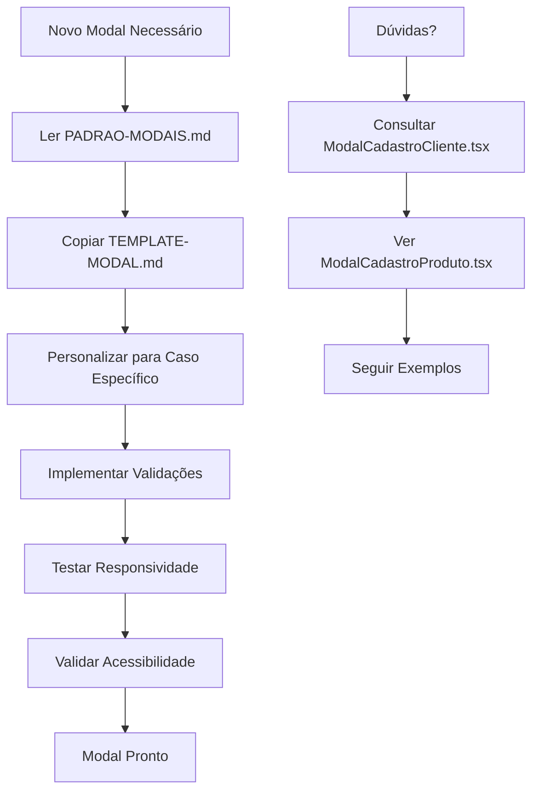

# 📚 Documentação do Sistema de Componentes - Fênix CRM

## 🎯 Visão Geral

Este diretório contém toda a documentação para o sistema de componentes base do Fênix CRM, estabelecendo padrões e diretrizes para desenvolvimento consistente de interfaces.

## 📋 Documentos Disponíveis

### 🏗️ [PADRAO-MODAIS.md](./PADRAO-MODAIS.md)
**Documentação completa do padrão de modais**
- Arquitetura dos componentes base
- Padrões de implementação
- Design system (cores, estilos, tipografia)
- Checklist para novos modais
- Exemplos de uso

### 🚀 [TEMPLATE-MODAL.md](./TEMPLATE-MODAL.md)
**Template pronto para uso**
- Código completo de template
- Instruções passo-a-passo
- Variações comuns (1 coluna, tabs, read-only)
- Guia de personalização

## 💼 Exemplos Práticos

### 📁 [/src/examples/](../src/examples/)

#### ✅ [ModalCadastroProduto.tsx](../src/examples/ModalCadastroProduto.tsx)
**Exemplo completo de implementação**
- Modal funcional usando todos os componentes base
- Validação com React Hook Form + Yup
- Layout em 3 colunas
- Status panel e badges
- Comentários explicativos

#### 🌟 [ModalCadastroCliente.tsx](../src/components/modals/ModalCadastroCliente.tsx)
**Referência padrão (modal real do sistema)**
- Implementação completa seguindo todos os padrões
- Validação avançada (CPF/CNPJ)
- Integração com API externa (ViaCEP)
- Sistema de tags
- Todos os recursos implementados

## 🧩 Componentes Base

### 📁 [/src/components/base/](../src/components/base/)

| Componente | Arquivo | Descrição |
|------------|---------|-----------|
| **BaseModal** | `BaseModal.tsx` | Modal principal padronizado |
| **FormField** | `FormComponents.tsx` | Campo de formulário com label/erro |
| **BaseInput** | `FormComponents.tsx` | Input padronizado |
| **BaseSelect** | `FormComponents.tsx` | Select padronizado |
| **BaseTextarea** | `FormComponents.tsx` | Textarea padronizado |
| **BaseButton** | `BaseComponents.tsx` | Botão com variants |
| **StatusBadge** | `BaseComponents.tsx` | Badge de status |
| **LoadingSpinner** | `BaseComponents.tsx` | Spinner de carregamento |
| **ThreeColumnLayout** | `ModalLayouts.tsx` | Layout 3 colunas |
| **ModalSection** | `ModalLayouts.tsx` | Seção de modal |
| **ModalFooter** | `ModalLayouts.tsx` | Footer padronizado |
| **StatusPanel** | `ModalLayouts.tsx` | Painel lateral |

### 📦 Import Centralizado
```tsx
import {
  BaseModal,
  FormField,
  BaseInput,
  BaseButton,
  ThreeColumnLayout
} from '@/components/base';
```

## 🚀 Guia Rápido

### 1. Para Criar um Novo Modal

1. **Copie o template** de `TEMPLATE-MODAL.md`
2. **Personalize** tipos e validações
3. **Ajuste** campos e layout
4. **Teste** responsividade e validação
5. **Siga** o checklist do `PADRAO-MODAIS.md`

### 2. Para Entender os Padrões

1. **Leia** `PADRAO-MODAIS.md` completo
2. **Estude** `ModalCadastroCliente.tsx` (referência)
3. **Experimente** `ModalCadastroProduto.tsx` (exemplo)
4. **Use** o template para novos modais

### 3. Para Contribuir

1. **Mantenha** compatibilidade com componentes existentes
2. **Documente** mudanças significativas
3. **Teste** em diferentes resoluções
4. **Valide** acessibilidade
5. **Atualize** documentação quando necessário

## 🎨 Design System

### Cores Principais
- **Primary**: `#159A9C` (Teal Fênix)
- **Success**: `#10B981` (Verde)
- **Error**: `#EF4444` (Vermelho)
- **Warning**: `#F59E0B` (Amarelo)

### Padrões de Espaçamento
- **Padding Modal**: `p-6`
- **Gaps**: `gap-4`, `gap-6`
- **Spacing**: `space-y-4`, `space-y-6`

### Tipografia
- **Título Modal**: `text-xl font-bold`
- **Labels**: `text-sm font-medium`
- **Erros**: `text-sm text-red-600`

## 🔄 Fluxo de Desenvolvimento



## 📞 Suporte

- **Dúvidas sobre padrões**: Consulte `PADRAO-MODAIS.md`
- **Como implementar**: Use `TEMPLATE-MODAL.md`
- **Exemplos práticos**: Veja `/src/examples/`
- **Referência completa**: Estude `ModalCadastroCliente.tsx`

---

**💡 Dica**: Sempre use o modal de clientes como referência de qualidade. Ele implementa todos os padrões e melhores práticas definidas nesta documentação.
